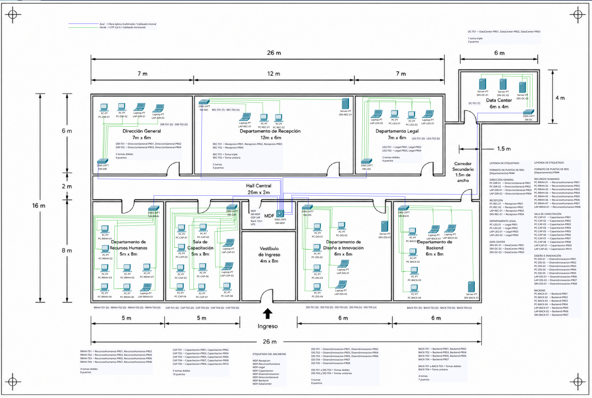

# Informe de Desarrollo

## Práctica 1 - QuetzalDev S.A.

| Información | Detalle |
|---|---|
| **Curso** | Redes de Computadoras 1 |
| **Universidad** | Universidad de San Carlos de Guatemala |
| **Facultad** | Facultad de Ingeniería |
| **Carrera** | Ingeniería en Ciencias y Sistemas |
| **Carnet** | 202113318 |
| **Semestre** | Segundo Semestre 2026 |

---

## 1. Introducción

El presente Informe de Desarrollo describe el proceso seguido para elaborar el diseño físico de la infraestructura de red propuesta para QuetzalDev S.A.

La práctica se desarrolló desde el punto de vista de la **Capa 1 del modelo OSI**, por lo que el trabajo se concentró en la distribución física de los dispositivos, ubicación de switches, selección del cuarto de telecomunicaciones principal, puntos y tomas de red, medios de transmisión, cableado horizontal, cableado troncal, canalización, elementos de terminación, respaldo eléctrico y organización general de la infraestructura.

Durante el desarrollo se utilizó como base el plano arquitectónico proporcionado para identificar las dimensiones y ubicación de los departamentos. A partir de esta información se realizó una propuesta que permitiera atender los **48 dispositivos finales** requeridos, manteniendo una infraestructura organizada, escalable y técnicamente viable.

El diseño final contempla una combinación de **UTP categoría 6 para el cableado horizontal** y **fibra óptica multimodo para los enlaces troncales**, utilizando una topología jerárquica en la infraestructura general y topologías en estrella dentro de cada departamento.

---

## 2. Objetivos

### 2.1 Objetivo General

Desarrollar una propuesta de infraestructura física de red para QuetzalDev S.A. que permita conectar los dispositivos de sus diferentes departamentos mediante una solución organizada de cableado estructurado, considerando principios de Capa 1, escalabilidad, mantenimiento y costos de implementación.

### 2.2 Objetivos Específicos

- Analizar el plano arquitectónico de QuetzalDev S.A.
- Distribuir correctamente los dispositivos finales entre los departamentos.
- Seleccionar una ubicación adecuada para el MDF.
- Definir la topología física general y la topología de cada departamento.
- Diseñar el cableado horizontal y el cableado troncal.
- Seleccionar medios de transmisión adecuados para cada segmento.
- Dimensionar switches, patch panels, ODF y demás componentes.
- Estimar las distancias y cantidades de cable requeridas.
- Definir las rutas de canalización.
- Documentar los estándares T568A y T568B.
- Diseñar un sistema de etiquetado para puntos de red y enlaces troncales.
- Estimar el consumo eléctrico del equipo activo y seleccionar una capacidad de UPS.
- Elaborar un presupuesto aproximado de implementación.
- Mantener capacidad disponible para futuras ampliaciones.

---

## 3. Análisis Inicial del Plano

El primer paso del desarrollo consistió en analizar el plano arquitectónico proporcionado para identificar los espacios disponibles y las dimensiones de las diferentes áreas.

Se identificaron los siguientes departamentos:

1. Recepción.
2. Recursos Humanos.
3. Legal.
4. Sala de Capacitación.
5. Diseño e Innovación.
6. Dirección General.
7. Backend.
8. Data Center.

También se identificaron áreas comunes como el Hall Central, el Vestíbulo de Ingreso y el corredor secundario que comunica con el Data Center.

Las dimensiones del plano permitieron establecer una referencia para estimar posteriormente las distancias de los enlaces de cableado.

Uno de los criterios utilizados durante esta etapa fue evitar considerar recorridos diagonales directos. En una instalación real, los cables normalmente siguen paredes, canalizaciones y corredores, por lo que las estimaciones se realizaron tomando como referencia este tipo de recorrido.

---

## 4. Distribución de Dispositivos

La empresa requiere un total de:

- **30 computadoras de escritorio.**
- **12 laptops.**
- **6 servidores.**

Esto representa:

**48 dispositivos finales.**

La distribución utilizada fue la siguiente:

| Área / Departamento | PCs | Laptops | Servidores | Total |
|---|---:|---:|---:|---:|
| Recepción | 2 | 1 | 1 | 4 |
| Recursos Humanos | 7 | 1 | 0 | 8 |
| Legal | 2 | 2 | 0 | 4 |
| Sala de Capacitación | 8 | 2 | 0 | 10 |
| Diseño e Innovación | 5 | 2 | 1 | 8 |
| Dirección General | 2 | 2 | 0 | 4 |
| Backend | 4 | 2 | 1 | 7 |
| Data Center | 0 | 0 | 3 | 3 |
| **Total** | **30** | **12** | **6** | **48** |

Cada dispositivo fue considerado como un punto de red independiente.

Por lo tanto, se requieren **48 enlaces horizontales**, además de los **8 enlaces troncales** utilizados para comunicar el MDF con los switches departamentales.

---

## 5. Selección y Ubicación del MDF

Uno de los aspectos más importantes del desarrollo fue seleccionar la ubicación del **MDF (Main Distribution Frame)**.

Inicialmente se consideró utilizar el Data Center como ubicación del switch principal. Sin embargo, esta alternativa fue descartada debido a que el Data Center se encuentra desplazado hacia el extremo derecho del plano.

Utilizar esa ubicación habría aumentado los recorridos hacia departamentos ubicados en el lado opuesto del edificio, principalmente:

- Recursos Humanos.
- Sala de Capacitación.
- Dirección General.

También se analizaron espacios como Recepción y Sala de Capacitación, pero se descartaron debido a que son áreas destinadas a usuarios y actividades normales de la empresa.

Finalmente, se seleccionó un espacio cerrado cercano al **Hall Central y al Vestíbulo de Ingreso**.

Esta ubicación ofrece las siguientes ventajas:

- Posición aproximadamente central respecto a los departamentos.
- Reducción de los recorridos troncales.
- Fácil distribución hacia el lado izquierdo y derecho del edificio.
- Posibilidad de mantener acceso restringido.
- Facilidad para realizar mantenimiento.
- Cercanía con las principales rutas de canalización.
- Espacio destinado exclusivamente a infraestructura de telecomunicaciones.

El MDF concentra principalmente:

- Switch principal.
- ODF.
- Rack.
- Organizadores.
- PDU.
- UPS.
- Terminaciones del backbone.

---

## 6. Selección de la Topología

### 6.1 Topología General

Para la infraestructura general se seleccionó una **topología jerárquica tipo árbol o estrella extendida**.

El switch principal ubicado en el MDF funciona como punto central de distribución y desde él parten ocho enlaces independientes hacia los switches de cada departamento.

La estructura puede resumirse como:

```text
                       MDF
                        │
                 Switch Principal
                        │
      ┌─────────────────┼─────────────────┐
      │                 │                 │
Switch Área       Switch Área       Switch Área
      │                 │                 │
   Hosts              Hosts              Hosts
```

Esta estructura facilita la administración y permite separar claramente el backbone de las conexiones de usuario.

---

### 6.2 Topología por Departamento

Dentro de cada departamento se seleccionó una **topología física en estrella**.

Cada dispositivo dispone de un enlace independiente hacia el switch de su área.

La topología en estrella fue elegida debido a los siguientes criterios:

- Permite conectar fácilmente diferentes cantidades de hosts.
- Facilita el mantenimiento.
- Permite localizar fallas de cableado de forma sencilla.
- Una falla en el cable de un usuario afecta únicamente a ese dispositivo.
- Permite agregar nuevos dispositivos mientras existan puertos disponibles.
- Presenta un costo menor que una solución con enlaces redundantes.
- Es compatible con la utilización de switches Ethernet.

En departamentos de mayor importancia operativa, como Backend y Data Center, se consideró también la criticidad de los dispositivos conectados.

Aunque una implementación empresarial podría utilizar redundancia adicional en estos segmentos, para el alcance de la práctica se mantuvo la topología en estrella debido al balance entre costo, complejidad y requerimientos actuales.

---

## 7. Selección de Medios de Transmisión

Uno de los principales criterios del diseño fue diferenciar el medio utilizado para el cableado horizontal del utilizado para el backbone.

Se seleccionaron:

| Segmento | Medio |
|---|---|
| Cableado horizontal | UTP Cat 6 |
| Cableado troncal | Fibra óptica multimodo |

---

### 7.1 Cableado Horizontal

Para los enlaces entre los dispositivos finales y los switches departamentales se seleccionó **UTP categoría 6**.

La elección se realizó considerando:

- Distancias cortas dentro de los departamentos.
- Facilidad de instalación.
- Facilidad de terminación.
- Disponibilidad comercial.
- Costo menor respecto a instalar fibra hasta cada dispositivo.
- Capacidad adecuada para conexiones Ethernet.
- Facilidad de mantenimiento y sustitución.

Cada uno de los 48 dispositivos dispone de su propio enlace UTP Cat 6.

---

### 7.2 Justificación del Medio para el Cableado Troncal

Para los enlaces entre el MDF y los switches departamentales se seleccionó **fibra óptica multimodo**.

Esta fue una de las decisiones principales del diseño.

La selección se realizó considerando los siguientes aspectos:

#### Capacidad de transmisión

El backbone concentra el tráfico proveniente de varios dispositivos, por lo que resulta conveniente utilizar un medio con mayor capacidad de transmisión.

#### Escalabilidad

La fibra óptica proporciona una infraestructura adecuada para futuras necesidades de mayor ancho de banda sin tener que reemplazar inmediatamente el medio troncal.

#### Interferencia electromagnética

La fibra transmite información mediante señales ópticas, por lo que presenta inmunidad frente a interferencias electromagnéticas.

#### Distancia

Los recorridos existentes dentro de QuetzalDev S.A. son adecuados para fibra multimodo.

El enlace troncal más largo estimado corresponde al Data Center y tiene una longitud aproximada de **22 metros**.

#### Costo

La fibra representa una inversión mayor respecto al cableado de cobre.

Por esta razón, su utilización se limitó al backbone de ocho enlaces, mientras que los 48 dispositivos finales utilizan UTP Cat 6.

De esta manera se obtiene un equilibrio entre:

**Costo + capacidad + escalabilidad.**

---

## 8. Puntos y Tomas de Red

Los 48 dispositivos finales requieren **48 puntos de red independientes**.

Para organizar físicamente estos puntos, los puertos fueron agrupados en tomas unitarias, dobles y triples.

La distribución final contempla:

| Tipo de toma | Cantidad | Puertos |
|---|---:|---:|
| Unitaria | 4 | 4 |
| Doble | 19 | 38 |
| Triple | 2 | 6 |
| **Total** | **25** | **48** |

Por lo tanto, se requieren:

- **25 ubicaciones físicas de tomas.**
- **48 puertos de red.**

Cada punto dispone de una etiqueta independiente, aunque pueda compartir la misma caja física con otros puntos.

---

## 9. Estimación del Cableado

Después de definir los dispositivos, switches y rutas, se realizó una estimación de las distancias.

### 9.1 Cableado Horizontal

La suma aproximada de los 48 enlaces horizontales fue:

**313 metros de UTP Cat 6.**

Se agregó un 10 % de reserva:

```text
313 m × 10 % = 31.3 m

313 m + 31.3 m = 344.3 m
```

Por lo tanto, la cantidad estimada requerida es aproximadamente:

**345 metros de UTP Cat 6.**

Las bobinas consideradas tienen una longitud estándar de:

**305 metros.**

El cálculo fue:

```text
344.3 m ÷ 305 m = 1.13 bobinas
```

Como no es posible adquirir una fracción de bobina:

**Se requieren 2 bobinas de 305 m.**

La cantidad total adquirida sería:

```text
2 × 305 m = 610 m
```

El cable restante puede utilizarse para mantenimiento, sustituciones o futuras ampliaciones.

---

### 9.2 Cableado Troncal

Las distancias aproximadas de los ocho enlaces troncales suman:

**85 metros.**

Se agregó una reserva del 15 %:

```text
85 m × 1.15 = 97.75 m
```

Por lo tanto, se consideraron aproximadamente:

**100 metros de fibra óptica multimodo.**

---

## 10. Dimensionamiento del Equipo Activo

La red requiere:

- **8 switches departamentales.**
- **1 switch principal en el MDF.**

Los switches departamentales fueron dimensionados de acuerdo con la cantidad de dispositivos actuales y dejando capacidad para crecimiento.

| Área | Dispositivos | Switch propuesto |
|---|---:|---:|
| Recepción | 4 | 8 puertos |
| Recursos Humanos | 8 | 16 puertos |
| Legal | 4 | 8 puertos |
| Sala de Capacitación | 10 | 16 puertos |
| Diseño e Innovación | 8 | 16 puertos |
| Dirección General | 4 | 8 puertos |
| Backend | 7 | 16 puertos |
| Data Center | 3 | 8 puertos |

Por lo tanto, se requieren:

- **4 switches de 8 puertos.**
- **4 switches de 16 puertos.**

Cada switch departamental deberá disponer además de una interfaz SFP/SFP+ para establecer el enlace óptico hacia el MDF.

El switch principal deberá disponer como mínimo de:

**8 interfaces ópticas.**

Se recomienda una capacidad superior a ocho interfaces para permitir crecimiento.

---

## 11. Patch Panels y Terminación

Se seleccionó un patch panel por departamento.

La capacidad propuesta es:

- 4 patch panels de 8 puertos.
- 4 patch panels de 12 puertos.

En total:

**80 puertos disponibles en patch panels.**

Actualmente se utilizan:

**48 puertos.**

Quedan disponibles:

**32 puertos.**

También se requieren:

- 48 keystone jacks RJ45 Cat 6.
- 96 patch cords UTP Cat 6.
- 25 placas o cajas para tomas.

Los 96 patch cords se obtienen de:

```text
48 dispositivo → toma
+
48 patch panel → switch
=
96 patch cords
```

---

## 12. Diseño del Backbone Óptico

Los ocho enlaces troncales se diseñaron como enlaces de fibra óptica multimodo dúplex.

Cada enlace utiliza:

**2 fibras**

Por lo tanto:

```text
8 enlaces × 2 fibras = 16 fibras
```

Se seleccionó un:

**ODF de 24 fibras**

De esta manera:

```text
24 - 16 = 8 fibras libres
```

Las 8 fibras restantes permiten disponer de capacidad para hasta:

**4 enlaces dúplex adicionales.**

La infraestructura óptica también contempla:

- 8 terminaciones ópticas departamentales.
- 16 módulos ópticos, uno por cada extremo de los 8 enlaces.
- 16 patch cords ópticos.
- Pigtails, adaptadores y elementos de terminación.

---

## 13. Canalización

Se utilizaron diferentes soluciones de canalización de acuerdo con el segmento.

### Cableado horizontal

Se propone:

**Canaleta cerrada de PVC.**

Esta solución permite mantener el cable UTP protegido y ordenado dentro de las oficinas.

### Cableado troncal

Se propone:

**Bandeja metálica cerrada.**

La bandeja permite transportar varios enlaces de fibra mediante una misma ruta principal.

Las principales rutas del backbone recorren el Hall Central y los corredores, realizando posteriormente derivaciones hacia cada departamento.

El diseño se dividió principalmente en:

- Ruta hacia el sector izquierdo.
- Ruta hacia el sector derecho.
- Derivación hacia Recepción.
- Continuación hacia el Data Center mediante el corredor secundario.

---

## 14. Diseño del Rack y MDF

Para el MDF se definió un rack de piso de 19 pulgadas.

El requerimiento mínimo estimado fue:

**12U o superior.**

Sin embargo, para el presupuesto se utilizó como referencia un rack comercial de **42U**, proporcionando un margen considerable para crecimiento.

Dentro del MDF se contempla la instalación de:

- ODF.
- Switch principal.
- Organizadores horizontales.
- PDU.
- UPS.
- Espacio para equipos adicionales.

La utilización de un rack de piso facilita la organización, mantenimiento, protección y ampliación de los equipos.

---

## 15. Estimación del Respaldo Eléctrico

Para dimensionar el sistema de respaldo se estimó el consumo de los nueve switches.

| Equipo | Cantidad | Consumo estimado | Total |
|---|---:|---:|---:|
| Switch principal | 1 | 60 W | 60 W |
| Switch de 8 puertos | 4 | 12 W | 48 W |
| Switch de 16 puertos | 4 | 20 W | 80 W |
| **Total** | **9** |  | **188 W** |

Se añadió un 25 % de margen:

```text
188 W × 0.25 = 47 W

188 W + 47 W = 235 W
```

La potencia de diseño estimada fue:

**235 W.**

Se propuso como referencia un UPS de:

**1000 VA / 600 W o superior.**

El UPS principal se instalará en el MDF.

Debido a que los switches departamentales están ubicados físicamente en diferentes áreas, para respaldarlos realmente sería necesario utilizar UPS locales o circuitos eléctricos respaldados.

---

## 16. Estándares de Cableado

Para mantener uniformidad en el cableado horizontal se seleccionó:

**T568B → T568B**

Esto genera conexiones straight-through.

Se documentaron los dos estándares:

- T568A.
- T568B.

También se documentó el cable crossover:

**T568A → T568B**

El crossover no se utiliza físicamente en la propuesta, debido a que las conexiones entre switches utilizan fibra óptica multimodo.

---

## 17. Etiquetado

Se estableció un sistema de etiquetado para facilitar la identificación de las conexiones.

### Cableado horizontal

Formato:

```text
[Área/Departamento]-PR##
```

Ejemplos:

```text
Recepcion-PR01
RecursosHumanos-PR04
Backend-PR07
DataCenter-PR03
```

### Tomas físicas

Formato:

```text
[Abreviatura]-T##
```

Ejemplos:

```text
REC-T01
RRHH-T02
BACK-T04
DC-T01
```

### Cableado troncal

Formato:

```text
MDF-[Área/Departamento]
```

Ejemplos:

```text
MDF-Recepcion
MDF-Backend
MDF-DataCenter
```

El esquema fue comparado con TIA/EIA-606.

El sistema utilizado en la práctica es más sencillo y permite identificar rápidamente el departamento y número de punto, mientras que un sistema completo basado en TIA/EIA-606 permite administrar de forma estructurada cables, espacios, rutas, terminaciones y registros asociados.

---

## 18. Desarrollo del Diagrama Físico

El diseño físico final fue representado utilizando **Cisco Packet Tracer** sobre el plano arquitectónico.

En el diagrama se colocaron:

- 30 computadoras de escritorio.
- 12 laptops.
- 6 servidores.
- 8 switches departamentales.
- 1 switch principal en el MDF.
- Rutas de cableado horizontal.
- Rutas de cableado troncal.
- Etiquetas de dispositivos.
- Puntos y tomas de red.
- Leyendas de identificación.

Para facilitar la interpretación visual se utilizó:

- **Verde:** cableado horizontal UTP Cat 6.
- **Azul:** cableado troncal de fibra óptica multimodo.

El diagrama representa la infraestructura física propuesta y no una configuración lógica de la red.

Los modelos utilizados dentro de Packet Tracer sirven principalmente como representación gráfica. En una implementación real deberán seleccionarse equipos que cumplan con las capacidades de puertos e interfaces ópticas establecidas en el Manual Técnico.



**Figura 1. Diseño físico final de la infraestructura de QuetzalDev S.A.**

---

## 19. Retos Encontrados Durante el Desarrollo

Durante el desarrollo de la práctica se presentaron diferentes retos relacionados principalmente con la planificación física.

### 19.1 Selección del MDF

Uno de los principales retos fue decidir dónde ubicar el MDF.

Aunque el Data Center parecía inicialmente una ubicación lógica, su posición en un extremo del edificio incrementaba las distancias hacia diferentes departamentos.

La solución fue utilizar una zona central cercana al Hall Central y al Vestíbulo.

---

### 19.2 Interpretación de Distancias

El plano proporciona dimensiones generales, pero no especifica el recorrido exacto de cada cable.

Fue necesario estimar las distancias considerando recorridos realistas mediante paredes, corredores y rutas de canalización.

Por esta razón, los valores documentados corresponden a estimaciones que deberán ser verificadas físicamente antes de una implementación real.

---

### 19.3 Separación entre Cableado Horizontal y Troncal

Otro reto fue evitar confundir los enlaces de usuario con los enlaces del backbone.

La solución consistió en definir claramente:

- UTP Cat 6 para cableado horizontal.
- Fibra multimodo para backbone.

También se utilizaron diferentes colores dentro del diagrama.

---

### 19.4 Diseño hacia el Data Center

El Data Center se encuentra separado del bloque principal y se comunica mediante un corredor secundario.

Fue necesario considerar esta ruta al diseñar el enlace troncal y estimar su distancia.

El resultado aproximado fue:

**22 metros desde el MDF hacia el switch del Data Center.**

---

### 19.5 Representación en Cisco Packet Tracer

Cisco Packet Tracer permite representar dispositivos y conexiones, pero los modelos disponibles no necesariamente coinciden exactamente con los equipos comerciales definidos en el diseño.

Por esta razón, los switches utilizados en el diagrama se consideran representaciones gráficas.

Los requerimientos reales de puertos, interfaces SFP/SFP+ y capacidad se encuentran especificados en el Manual Técnico.

---

### 19.6 Organización de la Información en el Plano

La representación de 48 dispositivos, 48 puntos de red, 25 tomas y 8 enlaces troncales podía saturar visualmente el plano.

Para evitarlo se utilizaron:

- Identificadores abreviados.
- Leyendas.
- Tablas de etiquetado.
- Colores para distinguir tipos de cableado.

El detalle completo se mantuvo en el Manual Técnico.

---

## 20. Decisiones Principales del Diseño

Durante el proceso se tomaron las siguientes decisiones:

| Aspecto | Decisión |
|---|---|
| Topología general | Árbol / estrella extendida |
| Topología departamental | Estrella |
| Cableado horizontal | UTP Cat 6 |
| Cableado troncal | Fibra óptica multimodo |
| MDF | Zona central cercana al Hall Central y Vestíbulo |
| Switches departamentales | 4 de 8 puertos y 4 de 16 puertos |
| Switch principal | Mínimo 8 interfaces ópticas, capacidad superior recomendada |
| Puntos de red | 48 |
| Tomas físicas | 25 |
| Cable UTP estimado | 313 m |
| Cable UTP con reserva | ≈ 345 m |
| Bobinas | 2 de 305 m |
| Fibra estimada | 85 m |
| Fibra con reserva | ≈ 100 m |
| ODF | 24 fibras |
| Canalización horizontal | Canaleta cerrada de PVC |
| Canalización troncal | Bandeja metálica cerrada |
| Rack | Piso, 19 pulgadas |
| UPS | 1000 VA / 600 W o superior |
| Terminación horizontal | T568B - T568B |
| Etiquetado horizontal | `[Área]-PR##` |
| Etiquetado troncal | `MDF-[Área]` |

---

## 21. Escalabilidad del Diseño

El diseño fue realizado dejando capacidad disponible para crecimiento.

Actualmente existen:

- 48 dispositivos finales.
- 96 puertos RJ45 disponibles en switches departamentales.
- 80 puertos disponibles en patch panels.
- 24 fibras disponibles en el ODF.

Después de utilizar la infraestructura actual quedan:

- **48 puertos libres en switches.**
- **32 puertos libres en patch panels.**
- **8 fibras libres en el ODF.**

El crecimiento inmediato de puntos cableados está limitado a **32 nuevos puntos**, debido a la disponibilidad de los patch panels.

Las 8 fibras libres permitirían implementar hasta:

**4 enlaces ópticos dúplex adicionales.**

El rack, canalización y switch principal también fueron seleccionados considerando espacio disponible para futuras ampliaciones.

---

## 22. Presupuesto

El presupuesto estimado para la infraestructura propuesta fue de:

# **Q38,957.00**

Este monto incluye principalmente:

- Switches.
- Módulos ópticos.
- Cable UTP.
- Fibra multimodo.
- Patch panels.
- Keystone jacks.
- Patch cords.
- ODF.
- Terminaciones ópticas.
- Rack.
- Organizadores.
- PDU.
- UPS.
- Canalización.
- Material de etiquetado.

Los valores son referencias comerciales y aproximadas, por lo que deberán actualizarse mediante una cotización antes de una implementación real.

No se incluyeron costos de:

- Mano de obra.
- Obra civil.
- Instalación eléctrica.
- Certificación del cableado.
- Herramientas especializadas.
- Transporte.

Para los materiales estandarizados puede realizarse una compra directa, mientras que para la instalación, terminación y certificación de fibra óptica se considera conveniente utilizar los servicios de un proveedor especializado.

---

## 23. Resultado Final

Como resultado de la práctica se obtuvo una propuesta completa de infraestructura física para QuetzalDev S.A.

El diseño final contempla:

- **48 dispositivos finales.**
- **48 puntos de red.**
- **25 tomas físicas.**
- **8 switches departamentales.**
- **1 switch principal.**
- **48 enlaces horizontales.**
- **8 enlaces troncales.**
- **UTP Cat 6 para las conexiones de usuarios.**
- **Fibra multimodo para el backbone.**
- **2 bobinas UTP de 305 m.**
- **Aproximadamente 100 m de fibra multimodo.**
- **8 patch panels.**
- **1 ODF de 24 fibras.**
- **Rack principal en el MDF.**
- **UPS de 1000 VA / 600 W como referencia.**
- **Sistema de etiquetado documentado.**
- **Rutas de canalización diferenciadas.**
- **Capacidad disponible para crecimiento futuro.**

La solución mantiene una separación clara entre la infraestructura horizontal y el backbone, facilitando la administración y mantenimiento de la red.

---

## 24. Conclusiones

El desarrollo de la práctica permitió aplicar los conceptos de infraestructura física y cableado estructurado en un escenario similar al de una empresa real.

La interpretación del plano arquitectónico fue fundamental para seleccionar la ubicación del MDF y definir las rutas de cableado. La posición central seleccionada facilita la distribución hacia los diferentes departamentos y reduce recorridos innecesarios.

La utilización de una topología jerárquica combinada con topologías en estrella permite mantener una infraestructura ordenada y fácil de ampliar. Además, una falla en un enlace horizontal afecta únicamente al dispositivo asociado, simplificando las tareas de mantenimiento.

La combinación de **UTP Cat 6 en el cableado horizontal y fibra óptica multimodo en el backbone** proporciona un equilibrio entre costo, capacidad y escalabilidad. La fibra se reserva para los enlaces principales, mientras que el cobre proporciona una solución económica para las conexiones de los dispositivos finales.

El dimensionamiento de switches, patch panels, ODF, rack y canalización deja capacidad disponible para futuras ampliaciones. Esto permite que la red pueda crecer sin sustituir inmediatamente toda la infraestructura existente.

Finalmente, el diseño desarrollado proporciona una propuesta técnicamente organizada para la infraestructura física de QuetzalDev S.A., documentando tanto los componentes necesarios como las decisiones y criterios utilizados durante el proceso de planificación.

---

## 25. Referencias

1. Universidad de San Carlos de Guatemala, Facultad de Ingeniería, Escuela de Ingeniería en Ciencias y Sistemas. (2026). **Práctica 1 - QuetzalDev S.A.** Laboratorio de Redes de Computadoras 1, Segundo Semestre 2026.

2. Universidad de San Carlos de Guatemala. (2026). **Lectura Semana 2 - Conceptos Generales de Redes de Computadoras.** Laboratorio de Redes de Computadoras 1.

3. Universidad de San Carlos de Guatemala. (2026). **Semana 3 - Cableado Estructurado.** Laboratorio de Redes de Computadoras 1.

4. Odom, W. (2019). **CCNA 200-301 Official Cert Guide, Volume 1.** Cisco Press.

5. Cisco Networking Academy. (2024). **Introduction to Networks.**

6. Telecommunications Industry Association. **ANSI/TIA-606 - Administration Standard for Telecommunications Infrastructure.**

7. Siemon. **Catálogo de soluciones de cableado estructurado.**

8. Panduit. **Catálogo de infraestructura de redes.**

9. Kemik Guatemala. **Catálogo comercial de equipos y materiales de red.**