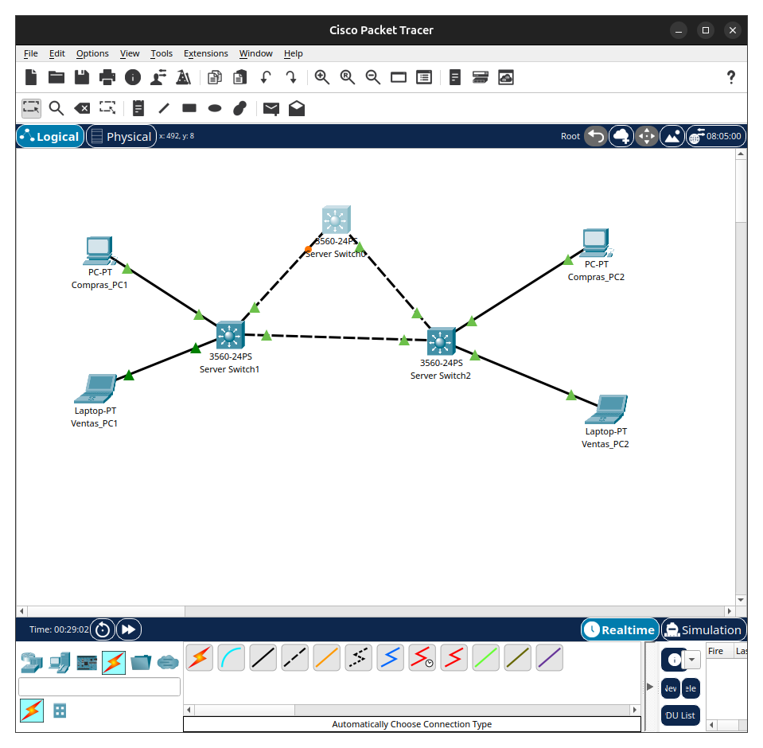
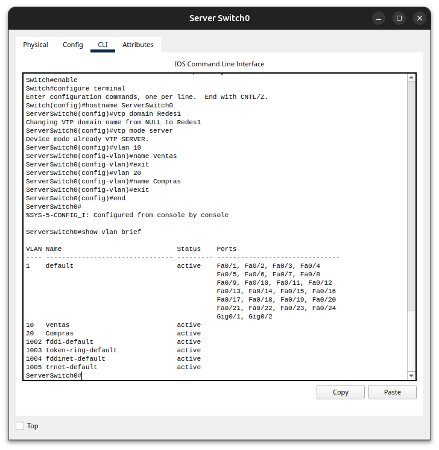
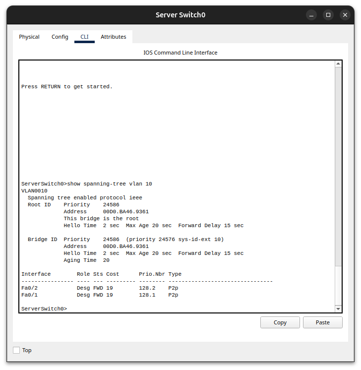
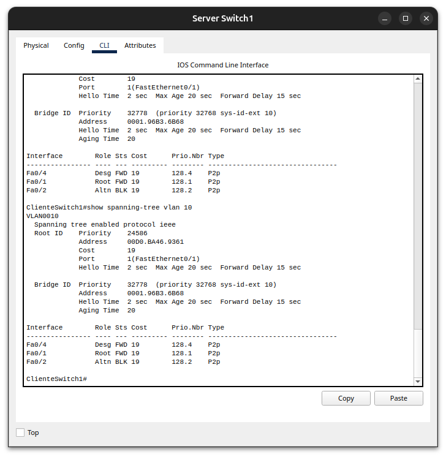
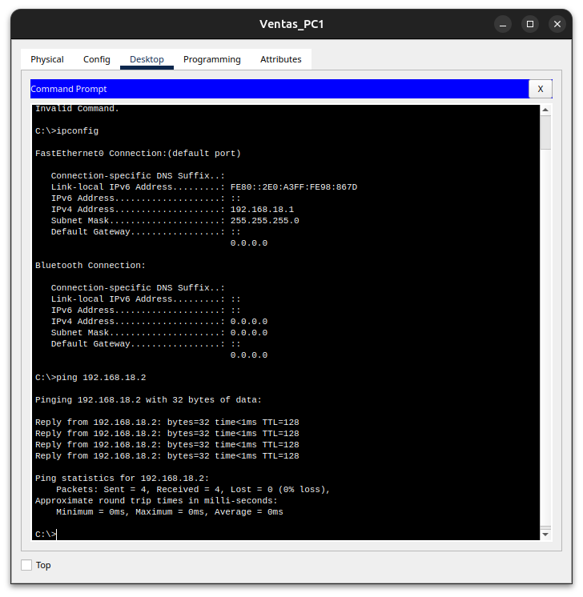
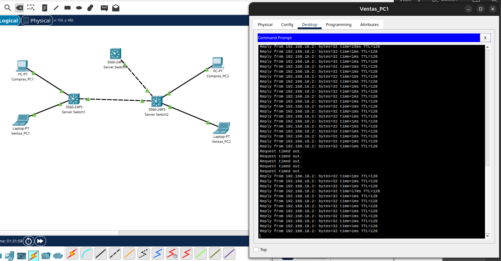
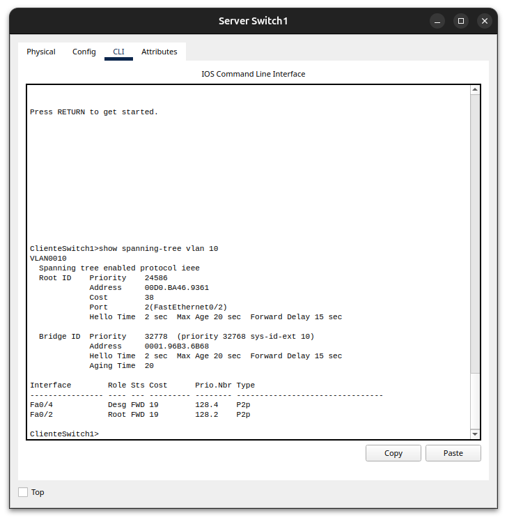
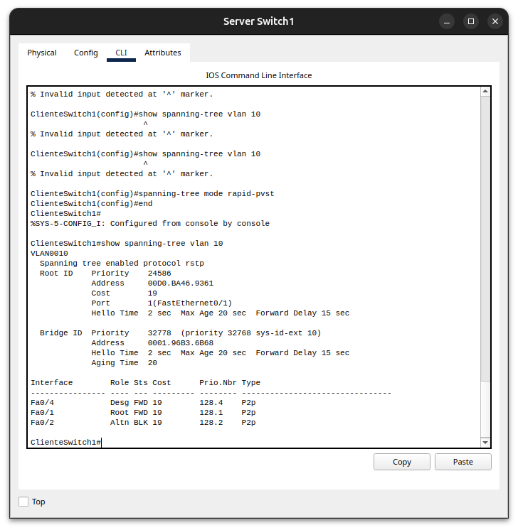
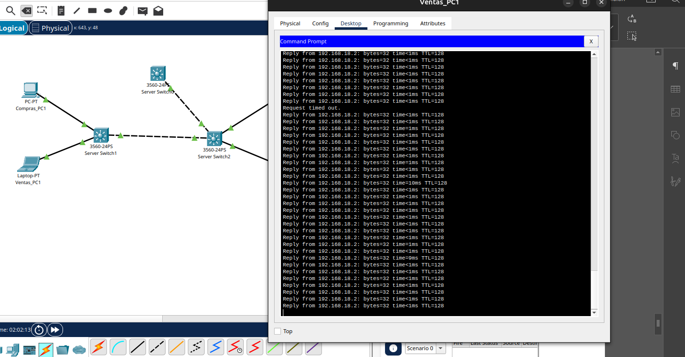

# Actividad Práctica 3 — STP, PVST y Rapid-PVST

**Curso:** Redes de Computadoras 1  
**Herramienta:** Cisco Packet Tracer  
**Tema:** Spanning Tree Protocol (STP), PVST y Rapid-PVST

---

## 1. Introducción

En esta práctica se implementó una red de capa 2 con enlaces redundantes para analizar el funcionamiento de **Spanning Tree Protocol (STP)**. La topología permite observar cómo STP evita bucles, elige un **Root Bridge**, mantiene un enlace alternativo bloqueado y utiliza dicho camino cuando ocurre una falla en el enlace principal.

También se comparó el comportamiento de **PVST** con **Rapid-PVST**, ejecutando pings continuos mientras se interrumpía un enlace entre switches. De esta forma se pudo observar la diferencia en el tiempo de convergencia de ambos protocolos.

---

## 2. Objetivos

- Implementar una topología con tres switches Cisco y enlaces redundantes.
- Crear y propagar las VLAN 10 **Ventas** y 20 **Compras**.
- Configurar `ServerSwitch0` como servidor VTP y Root Bridge de STP.
- Identificar el Root Port, los puertos Designated y el puerto Alternate/Blocking.
- Verificar conectividad entre equipos pertenecientes a una misma VLAN.
- Analizar la convergencia de PVST ante una falla de enlace.
- Configurar Rapid-PVST y comparar su convergencia con PVST.

---

## 3. Topología de red

Se utilizaron tres switches Cisco 3560 conectados en forma de triángulo. Esta disposición proporciona enlaces redundantes y permite que STP bloquee lógicamente uno de los caminos para prevenir bucles de capa 2.

Los equipos finales se distribuyeron entre los dos switches de acceso, colocando un dispositivo de la VLAN 10 y otro de la VLAN 20 en cada lado de la topología.



**Figura 1. Topología utilizada en la práctica.** La red está formada por tres switches Cisco 3560 conectados mediante enlaces redundantes y cuatro dispositivos finales distribuidos entre las VLAN Ventas y Compras.

### 3.1 Roles de los switches

| Dispositivo | Función |
|---|---|
| `ServerSwitch0` | Servidor VTP y Root Bridge de STP |
| `ClienteSwitch1` | Cliente VTP y switch de acceso |
| `ClienteSwitch2` | Cliente VTP y switch de acceso |

### 3.2 VLAN utilizadas

| VLAN | Nombre | Uso |
|---:|---|---|
| 10 | Ventas | Segmento de equipos del área de Ventas |
| 20 | Compras | Segmento de equipos del área de Compras |

### 3.3 Direccionamiento IPv4

El último dígito utilizado para construir las redes fue **8**, por lo que se trabajó con las redes `192.168.18.0/24` para Ventas y `192.168.28.0/24` para Compras.

| Equipo | VLAN | Dirección IPv4 | Máscara |
|---|---:|---|---|
| `Ventas_PC1` | 10 | `192.168.18.1` | `255.255.255.0` |
| `Ventas_PC2` | 10 | `192.168.18.2` | `255.255.255.0` |
| `Compras_PC1` | 20 | `192.168.28.1` | `255.255.255.0` |
| `Compras_PC2` | 20 | `192.168.28.2` | `255.255.255.0` |

No fue necesario configurar gateway predeterminado, ya que las pruebas se realizaron entre dispositivos pertenecientes a la misma VLAN y no se implementó enrutamiento inter-VLAN.

---

## 4. Configuración de VTP y VLAN

### 4.1 ServerSwitch0

`ServerSwitch0` se configuró como servidor VTP. En este switch se crearon las VLAN 10 y 20, las cuales posteriormente fueron propagadas a los switches clientes.

```cisco
configure terminal
hostname ServerSwitch0
vtp domain Redes1
vtp mode server

vlan 10
 name Ventas
exit

vlan 20
 name Compras
exit
```

Para verificar las VLAN se utilizó:

```cisco
show vlan brief
```



**Figura 2. Configuración de VLANs en ServerSwitch0.** Mediante el comando `show vlan brief` se verificó la creación de la VLAN 10 denominada Ventas y la VLAN 20 denominada Compras, ambas en estado activo.

### 4.2 Configuración de enlaces trunk

Los enlaces entre switches se configuraron como troncales para permitir el transporte de las VLAN 10 y 20.

En `ServerSwitch0`:

```cisco
interface fa0/1
 switchport trunk encapsulation dot1q
 switchport mode trunk
exit

interface fa0/2
 switchport trunk encapsulation dot1q
 switchport mode trunk
exit
```

En los switches clientes se utilizaron `Fa0/1` y `Fa0/2` como enlaces entre switches y se configuraron de la misma forma.

> **Nota:** En Cisco Packet Tracer la configuración se realizó interfaz por interfaz para establecer primero la encapsulación `dot1q` y posteriormente activar el modo trunk.

### 4.3 ClienteSwitch1

```cisco
configure terminal
hostname ClienteSwitch1
vtp domain Redes1
vtp mode client

interface fa0/1
 switchport trunk encapsulation dot1q
 switchport mode trunk
exit

interface fa0/2
 switchport trunk encapsulation dot1q
 switchport mode trunk
exit

interface fa0/3
 switchport mode access
 switchport access vlan 20
exit

interface fa0/4
 switchport mode access
 switchport access vlan 10
exit
```

### 4.4 ClienteSwitch2

```cisco
configure terminal
hostname ClienteSwitch2
vtp domain Redes1
vtp mode client

interface fa0/1
 switchport trunk encapsulation dot1q
 switchport mode trunk
exit

interface fa0/2
 switchport trunk encapsulation dot1q
 switchport mode trunk
exit

interface fa0/3
 switchport mode access
 switchport access vlan 20
exit

interface fa0/4
 switchport mode access
 switchport access vlan 10
exit
```

---

## 5. Implementación y análisis de STP / PVST

### 5.1 Elección del Root Bridge

Para asegurar que `ServerSwitch0` fuera elegido como raíz para las VLAN utilizadas, se configuró:

```cisco
spanning-tree vlan 1,10,20 root primary
```

La elección del Root Bridge se basa en el **Bridge ID**, compuesto principalmente por la prioridad del switch y su dirección MAC. El switch con el Bridge ID más bajo es seleccionado como raíz. El comando `root primary` redujo la prioridad de `ServerSwitch0`, haciendo que fuera elegido como Root Bridge.

La verificación se realizó mediante:

```cisco
show spanning-tree vlan 10
```



**Figura 3. Verificación del Root Bridge para la VLAN 10.** La salida muestra el mensaje `This bridge is the root`, confirmando que `ServerSwitch0` funciona como switch raíz. Sus interfaces `Fa0/1` y `Fa0/2` se encuentran como puertos Designated en estado Forwarding.

### 5.2 Puerto bloqueado por STP

Al existir tres enlaces entre switches se forma un camino redundante. STP evita el bucle manteniendo uno de estos enlaces fuera del estado de reenvío.

En `ClienteSwitch1` se ejecutó:

```cisco
show spanning-tree vlan 10
```



**Figura 4. Verificación del puerto bloqueado por STP.** La interfaz `Fa0/2` aparece con rol `Altn` y estado `BLK`, por lo que funciona como puerto Alternate/Blocking. `Fa0/1` funciona como Root Port en estado Forwarding hacia el switch raíz.

La interpretación de los puertos es la siguiente:

| Interfaz | Rol | Estado | Función |
|---|---|---|---|
| `Fa0/1` | Root | FWD | Camino principal hacia el Root Bridge |
| `Fa0/2` | Alternate | BLK | Camino redundante bloqueado por STP |
| `Fa0/4` | Designated | FWD | Puerto de acceso de la VLAN 10 |

---

## 6. Prueba de conectividad

Antes de realizar las pruebas de convergencia se verificó el direccionamiento y la conectividad entre los dispositivos de la VLAN 10.

Desde `Ventas_PC1` se ejecutaron:

```text
ipconfig
ping 192.168.18.2
```



**Figura 5. Verificación de direccionamiento y conectividad en VLAN 10 Ventas.** `Ventas_PC1` utiliza la dirección `192.168.18.1/24` y obtuvo cuatro respuestas de `Ventas_PC2` (`192.168.18.2`), con 0 % de pérdida de paquetes.

---

## 7. Prueba de convergencia con PVST

Para analizar la convergencia de STP se inició un ping continuo desde `Ventas_PC1` hacia `Ventas_PC2`:

```text
ping -t 192.168.18.2
```

Mientras el ping estaba en ejecución se interrumpió el enlace principal entre `ClienteSwitch1` y `ServerSwitch0` (`Fa0/1 ↔ Fa0/1`).



**Figura 6. Prueba de convergencia con PVST.** Durante la falla del enlace se observaron varios mensajes `Request timed out`. Después del proceso de reconvergencia, el tráfico se restableció mediante el camino redundante.

### 7.1 Cambio del puerto raíz después de la falla

Después de interrumpir el enlace principal se ejecutó nuevamente:

```cisco
show spanning-tree vlan 10
```



**Figura 7. Cambio de ruta después de la convergencia de PVST.** `Fa0/2`, que antes funcionaba como Alternate/Blocking, pasó a ser el nuevo Root Port en estado Forwarding. El costo hacia el Root Bridge aumentó a 38 porque el tráfico ahora debía atravesar `ClienteSwitch2` antes de llegar a `ServerSwitch0`.

Esto demuestra que STP mantiene redundancia: el enlace alternativo permanece bloqueado mientras el camino principal está disponible y es habilitado cuando ocurre una falla.

---

## 8. Configuración de Rapid-PVST

Después de restaurar el enlace original, se cambió el modo de Spanning Tree a Rapid-PVST en los tres switches:

```cisco
configure terminal
spanning-tree mode rapid-pvst
end
```

La configuración se verificó en `ClienteSwitch1` mediante:

```cisco
show spanning-tree vlan 10
```



**Figura 8. Verificación de Rapid-PVST en ClienteSwitch1.** La salida muestra `Spanning tree enabled protocol rstp`, confirmando el cambio a Rapid-PVST. `Fa0/1` continúa como Root Port, `Fa0/2` como puerto alternativo y `Fa0/4` como puerto designado.

---

## 9. Prueba de convergencia con Rapid-PVST

Se repitió la misma prueba utilizada con PVST. Se inició un ping continuo entre los equipos de Ventas y se interrumpió nuevamente el enlace principal entre `ClienteSwitch1` y `ServerSwitch0`.



**Figura 9. Prueba de convergencia con Rapid-PVST.** Durante la transición visible no se observaron pérdidas de paquetes. Rapid-PVST utilizó el camino redundante de forma más rápida que PVST, manteniendo la comunicación durante la prueba observada.

### 9.1 Comparación PVST vs Rapid-PVST

| Característica observada | PVST | Rapid-PVST |
|---|---|---|
| Protocolo mostrado | `ieee` | `rstp` |
| Enlace redundante en operación normal | Bloqueado | Alternativo / descartando |
| Comportamiento al perder el enlace principal | Se observaron varios paquetes perdidos | No se observaron pérdidas en la transición visible |
| Convergencia observada | Más lenta | Más rápida |
| Recuperación mediante camino redundante | Sí | Sí |

La principal diferencia observada fue el **tiempo de convergencia**. PVST necesitó un periodo apreciable para cambiar el enlace alternativo al estado de reenvío, mientras que Rapid-PVST reaccionó más rápidamente y redujo la interrupción del tráfico.

---

## 10. Respuestas al análisis solicitado

### ¿Qué sucede con los paquetes al eliminar un camino usando PVST?

Al interrumpir el enlace principal se pierden temporalmente algunos paquetes. STP detecta el cambio de topología, recalcula el árbol y habilita el enlace redundante que anteriormente se encontraba bloqueado. Después de la convergencia, los pings vuelven a responder.

### ¿Existe convergencia con PVST?

Sí. La prueba demostró que la red recuperó automáticamente la comunicación utilizando el camino alternativo. La salida de `show spanning-tree vlan 10` confirmó que `Fa0/2` pasó de Alternate/Blocking a Root/Forwarding.

### ¿Qué sucede al utilizar Rapid-PVST?

Rapid-PVST mantiene la misma finalidad de evitar bucles y conservar redundancia, pero su reacción ante los cambios de topología es más rápida. En la prueba realizada no se observaron paquetes perdidos durante la transición visible del ping continuo.

### ¿Qué mejora se observó?

La mejora principal fue una **convergencia más rápida**, lo que reduce el tiempo de interrupción cuando falla un enlace y mejora la disponibilidad de la red.

---

## 11. Conclusiones

La práctica permitió comprobar que STP es fundamental en redes con enlaces redundantes, ya que evita bucles de capa 2 mediante la elección de un Root Bridge y el bloqueo lógico de caminos alternativos. `ServerSwitch0` fue establecido como switch raíz y `ClienteSwitch1` mantuvo `Fa0/2` como enlace alternativo mientras el enlace principal se encontraba disponible.

Durante la prueba con PVST se observó pérdida temporal de paquetes después de desconectar el enlace principal; posteriormente la comunicación fue recuperada utilizando el camino redundante. La salida de STP confirmó que el puerto anteriormente bloqueado pasó a funcionar como Root Port.

Al cambiar los tres switches a Rapid-PVST, la misma prueba mostró una recuperación más rápida y no se observaron pérdidas de paquetes durante la transición visible. Por lo tanto, Rapid-PVST ofrece una mejora en el tiempo de convergencia y permite reducir las interrupciones de comunicación ante fallas de enlaces.

---

## 12. Comandos principales utilizados

```cisco
show vlan brief
show interfaces trunk
show spanning-tree vlan 10
show spanning-tree vlan 20
show vtp status
```

En las PCs:

```text
ipconfig
ping 192.168.18.2
ping -t 192.168.18.2
```

---

**Archivo de simulación asociado:** entregar junto con este documento el archivo `.pkt` correspondiente a la práctica.
