# Proyecto 1 — SmartCity Tech Park

**Curso:** Redes de Computadoras 1  
**Carné:** 202113318  
**Archivo Packet Tracer:** `Proyecto1_202113318.pkt`  

---

## 1. Objetivo

Diseñar e implementar en Cisco Packet Tracer una red LAN corporativa para **SmartCity Tech Park**, aplicando conceptos de Capa 1 y Capa 2, principalmente:

- VLANs.
- VTP.
- enlaces Trunk y Access.
- PVST.
- EtherChannel mediante LACP.
- redundancia.
- selección de medios físicos.
- documentación y pruebas de conectividad.

> Este documento se irá actualizando conforme avance la implementación de las demás áreas.

---

## 2. Parámetros asignados por carné

Para el carné `202113318`:

| Parámetro | Valor |
|---|---|
| Último dígito `X` | `8` |
| Penúltimo dígito | `1` |
| Dominio VTP | `Smart_1` |
| Contraseña VTP | `proyecto12S2026` |
| VLAN Gerencia | `18` — `GERENCIA` |
| VLAN Investigación | `28` — `INVESTIGACION` |
| VLAN Producción | `38` — `PRODUCCION` |
| VLAN Servidores | `48` — `SERVIDORES` |
| VLAN Visitantes | `58` — `VISITANTES` |
| VLAN nativa | `98` — `NATIVA` |
| EtherChannel | `LACP` |
| STP | `PVST` |
| Banner MOTD | `Acceso Restringido - TechPark_202113318` |

---

# 3. Avance actual — Centro de Datos

El Centro de Datos se inició utilizando dos dispositivos `Switch-PT`:

- `CORE-SW`: switch principal del campus.
- `SERVER-SW`: switch destinado a la granja de servidores.

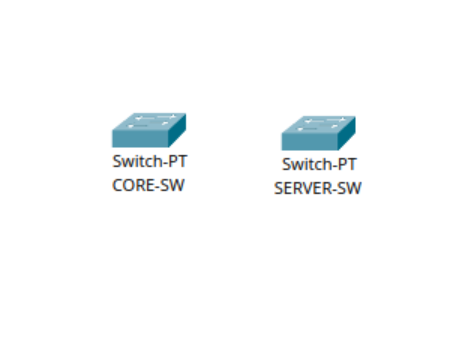

Posteriormente se agregaron cuatro servidores:

- `SRV1`
- `SRV2`
- `SRV3`
- `SRV4`

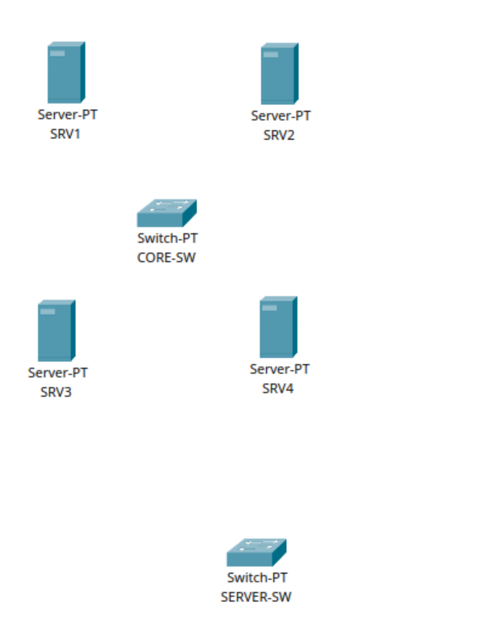

---

## 3.1 Preparación física de SERVER-SW

`SERVER-SW` utiliza interfaces de cobre para los cuatro servidores y dos interfaces de fibra para la interconexión redundante con `CORE-SW`.

Se instalaron:

- 4 interfaces FastEthernet de cobre.
- 2 interfaces FastEthernet de fibra `100Base-FX`.

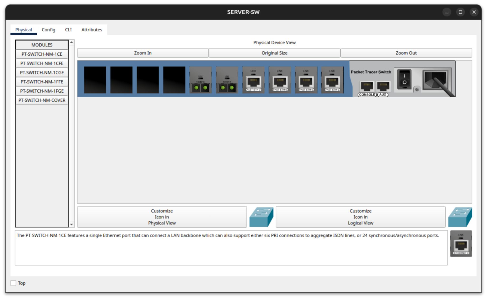

### Justificación

Los servidores se conectan localmente mediante cobre debido a la corta distancia dentro del Centro de Datos. Para el enlace entre switches se utiliza fibra, permitiendo representar un backbone de mayor capacidad y proporcionando interfaces compatibles para EtherChannel.

---

## 3.2 Preparación física de CORE-SW

En `CORE-SW` se instalaron interfaces adicionales de fibra FastEthernet `100Base-FX`, dejando disponibles interfaces para el backbone del campus.

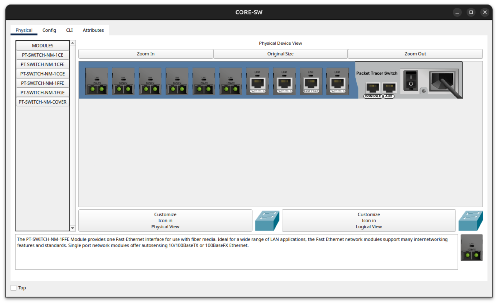

---

## 3.3 Conexión de servidores

Los cuatro servidores se conectaron a `SERVER-SW` mediante enlaces de cobre.

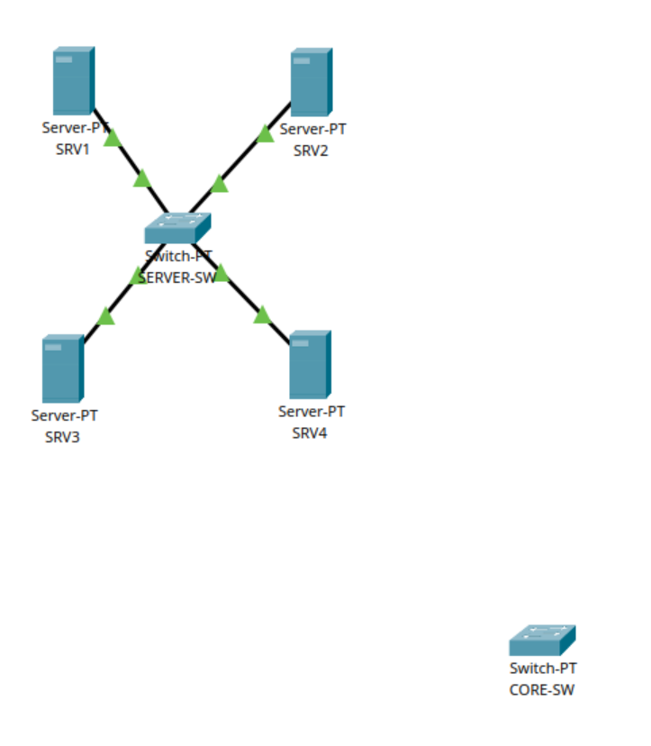

Los puertos utilizados en `SERVER-SW` son:

| Dispositivo | Puerto de SERVER-SW | Tipo |
|---|---|---|
| SRV1 | `Fa0/1` | Access |
| SRV2 | `Fa1/1` | Access |
| SRV3 | `Fa2/1` | Access |
| SRV4 | `Fa3/1` | Access |

Todos estos puertos se asignaron posteriormente a la VLAN 48 `SERVIDORES`.

---

# 4. EtherChannel entre SERVER-SW y CORE-SW

Se utilizaron dos enlaces de fibra entre los switches:

```text
SERVER-SW Fa4/1  <-------- fibra -------->  CORE-SW Fa4/1
SERVER-SW Fa5/1  <-------- fibra -------->  CORE-SW Fa5/1
```

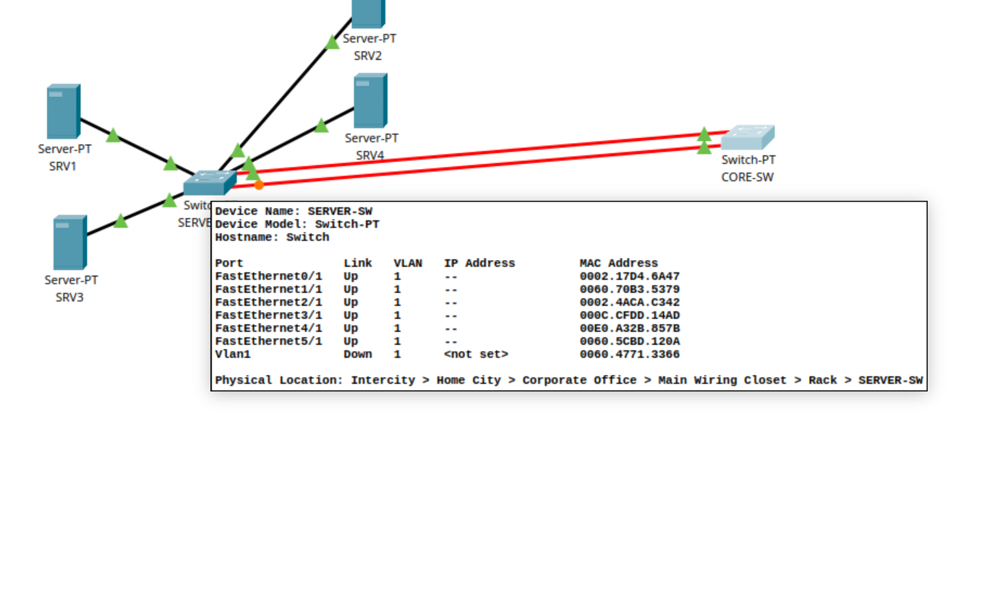

En `CORE-SW` se verificó que las interfaces utilizadas estuvieran activas.

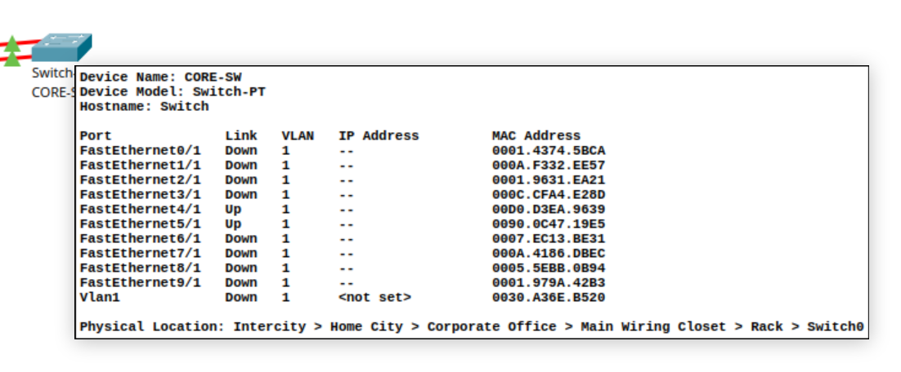

---

## 4.1 Configuración LACP en SERVER-SW

```cisco
enable
configure terminal

hostname SERVER-SW

interface range fastEthernet 4/1 , fastEthernet 5/1
 channel-protocol lacp
 channel-group 1 mode active
exit

end
copy running-config startup-config
```

---

## 4.2 Configuración LACP en CORE-SW

```cisco
enable
configure terminal

hostname CORE-SW

interface range fastEthernet 4/1 , fastEthernet 5/1
 channel-protocol lacp
 channel-group 1 mode active
exit

end
copy running-config startup-config
```

---

## 4.3 Verificación de EtherChannel

Comando utilizado:

```cisco
show etherchannel summary
```

Resultado esperado:

```text
Po1(SU)   LACP   Fa4/1(P) Fa5/1(P)
```

Donde:

- `S`: EtherChannel de Capa 2.
- `U`: Port-Channel en uso.
- `P`: interfaz agregada correctamente al Port-Channel.

### Evidencia CORE-SW

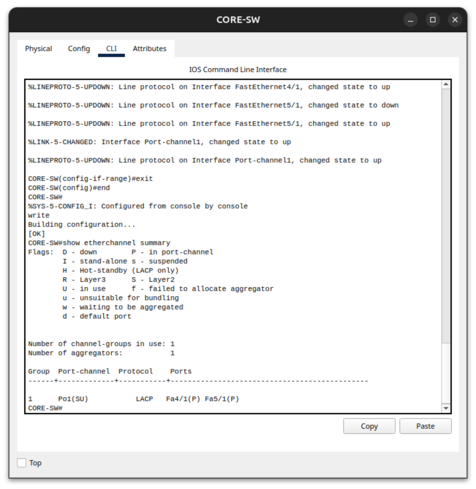

### Evidencia SERVER-SW

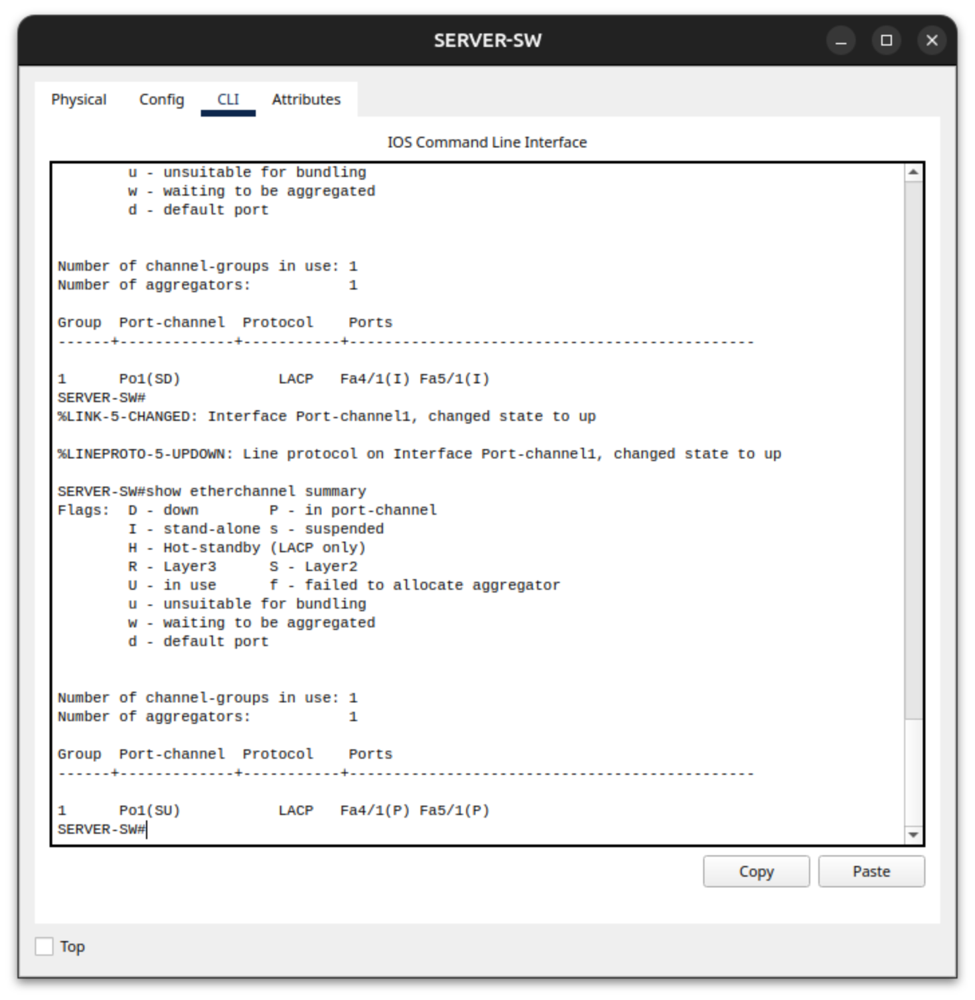

**Resultado:** el Port-Channel 1 quedó operativo en ambos extremos.

---

# 5. Configuración VTP y VLANs

`CORE-SW` se configuró como servidor VTP.

## 5.1 CORE-SW — VTP Server y creación de VLANs

```cisco
enable
configure terminal

vtp domain Smart_1
vtp mode server
vtp password proyecto12S2026
vtp version 2

spanning-tree mode pvst

vlan 18
 name GERENCIA
exit

vlan 28
 name INVESTIGACION
exit

vlan 38
 name PRODUCCION
exit

vlan 48
 name SERVIDORES
exit

vlan 58
 name VISITANTES
exit

vlan 98
 name NATIVA
exit

end
copy running-config startup-config
```

### Verificación de VLANs

```cisco
show vlan brief
```

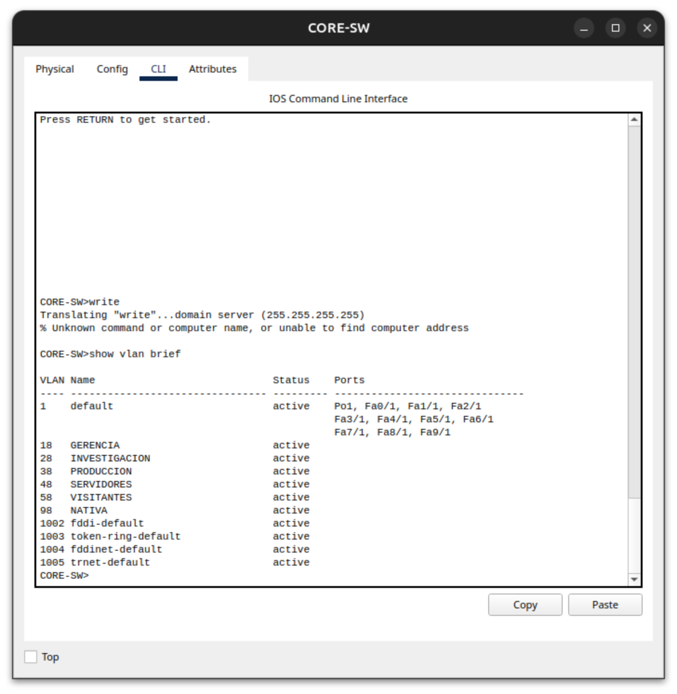

---

## 5.2 Verificación VTP en CORE-SW

Comando:

```cisco
show vtp status
```

Parámetros comprobados:

```text
VTP Version        : 2
VTP Operating Mode : Server
VTP Domain Name    : Smart_1
VTP V2 Mode        : Enabled
```

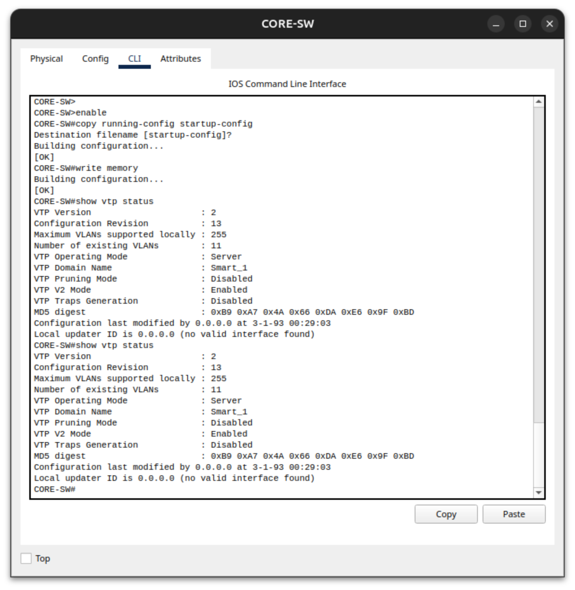

---

## 5.3 SERVER-SW — VTP Client

```cisco
enable
configure terminal

vtp domain Smart_1
vtp mode client
vtp password proyecto12S2026
vtp version 2

spanning-tree mode pvst

end
copy running-config startup-config
```

La propagación se comprobó con:

```cisco
show vlan brief
```

Las VLANs recibidas automáticamente fueron:

```text
18  GERENCIA
28  INVESTIGACION
38  PRODUCCION
48  SERVIDORES
58  VISITANTES
98  NATIVA
```

---

# 6. Configuración del trunk sobre Port-Channel 1

El EtherChannel entre `CORE-SW` y `SERVER-SW` se configuró como enlace troncal.

## 6.1 SERVER-SW

```cisco
enable
configure terminal

interface port-channel 1
 switchport mode trunk
 switchport trunk native vlan 98
 switchport trunk allowed vlan 18,28,38,48,58,98
exit

end
copy running-config startup-config
```

## 6.2 CORE-SW

```cisco
enable
configure terminal

interface port-channel 1
 switchport mode trunk
 switchport trunk native vlan 98
 switchport trunk allowed vlan 18,28,38,48,58,98
exit

end
copy running-config startup-config
```

### Verificación

```cisco
show interfaces trunk
```

Se verificó que:

- `Po1` esté en estado `trunking`.
- la encapsulación sea `802.1Q`.
- la VLAN nativa sea `98`.
- las VLANs `18,28,38,48,58,98` estén permitidas y activas.

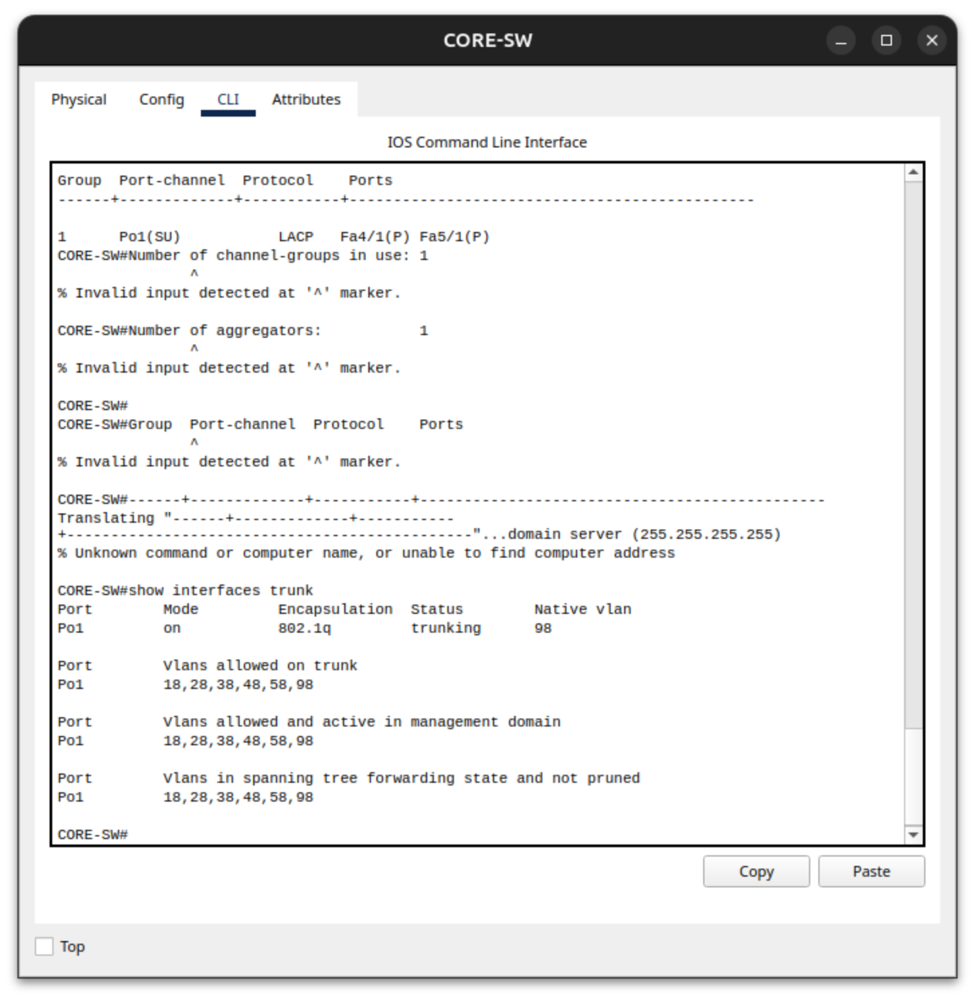

---

# 7. VLAN 48 — SERVIDORES

Los puertos de los cuatro servidores fueron configurados como Access dentro de la VLAN 48.

```cisco
enable
configure terminal

interface range fastEthernet 0/1 , fastEthernet 1/1 , fastEthernet 2/1 , fastEthernet 3/1
 switchport mode access
 switchport access vlan 48
exit

end
copy running-config startup-config
```

Verificación:

```cisco
show vlan brief
```

Resultado:

```text
48   SERVIDORES   active   Fa0/1, Fa1/1, Fa2/1, Fa3/1
```

---

# 8. Configuración de PVST y Root Bridge

Por tratarse de un carné par se utiliza `PVST`.

`CORE-SW` se seleccionó como Root Bridge porque funciona como núcleo del campus y concentra los enlaces principales del backbone.

Configuración:

```cisco
enable
configure terminal

spanning-tree vlan 18,28,38,48,58,98 priority 4096

end
copy running-config startup-config
```

Verificación utilizada:

```cisco
show spanning-tree vlan 48
```

Salida obtenida:

```text
VLAN0048
  Spanning tree enabled protocol ieee
  Root ID    Priority    4144
             Address     0030.A36E.B520
             This bridge is the root

  Bridge ID  Priority    4144
             Address     0030.A36E.B520

Interface        Role Sts
---------------- ---- ---
Po1              Desg FWD
Fa4/1            Desg FWD
Fa5/1            Desg FWD
```

La frase:

```text
This bridge is the root
```

confirma que `CORE-SW` es el Root Bridge para la VLAN 48.

> **Captura pendiente:** agregar posteriormente una captura limpia de `show spanning-tree vlan 48`.

---

# 9. Banner MOTD

En `CORE-SW` se configuró:

```cisco
enable
configure terminal

banner motd #Acceso Restringido - TechPark_202113318#

end
copy running-config startup-config
```

Mensaje configurado:

```text
Acceso Restringido - TechPark_202113318
```

> El banner deberá agregarse también a los switches de distribución correspondientes conforme avance el proyecto.

---

# 10. Comandos de verificación utilizados

```cisco
show vlan brief
show vtp status
show etherchannel summary
show interfaces trunk
show spanning-tree vlan 48
```

Posteriormente también se utilizarán:

```cisco
show spanning-tree
show running-config
```
# Centro de Investigación y Desarrollo (I+D)

## Diseño del área

Para el Centro de Investigación y Desarrollo se implementó una topología redundante formada por tres switches:

- `ID-SW1`
- `ID-SW2`
- `ID-SW3`

Los switches fueron interconectados en forma de triángulo con el objetivo de proporcionar caminos alternativos ante la falla de un enlace.

La topología utilizada es conceptualmente la siguiente:

```text
                       CORE-SW
                    ║           ║
                    ║   LACP    ║
                    ║           ║
                      ID-SW1
                      /    \
                     /      \
                ID-SW2 ---- ID-SW3
```

También se colocaron ocho estaciones de trabajo distribuidas de la siguiente manera:

| Switch | Estaciones |
|---|---|
| ID-SW1 | ID-PC1, ID-PC2 |
| ID-SW2 | ID-PC3, ID-PC4, ID-PC5 |
| ID-SW3 | ID-PC6, ID-PC7, ID-PC8 |

De esta forma, el área cuenta con ocho estaciones de trabajo y redundancia entre los switches.

> **Captura sugerida:** `evidencias/13_topologia_id.png`


---

## Preparación física de los switches

Se utilizaron dispositivos `Switch-PT` para permitir la instalación de módulos de cobre y fibra.

### ID-SW1

Se instalaron:

- 2 módulos FastEthernet de fibra `PT-SWITCH-NM-1FFE`.
- 4 módulos FastEthernet de cobre `PT-SWITCH-NM-1CFE`.

Los dos puertos de fibra se utilizan para el enlace principal de mayor capacidad hacia `CORE-SW`.

### ID-SW2

Se instalaron:

- 1 módulo FastEthernet de fibra.
- 5 módulos FastEthernet de cobre.

### ID-SW3

Se instalaron:

- 5 módulos FastEthernet de cobre.

---

## Distribución de puertos

Los puertos utilizados quedaron distribuidos de la siguiente manera.

### ID-SW1

| Puerto | Conexión |
|---|---|
| Fa0/1 | ID-PC1 |
| Fa1/1 | ID-PC2 |
| Fa2/1 | ID-SW2 |
| Fa3/1 | ID-SW3 |
| Fa4/1 | CORE-SW mediante EtherChannel |
| Fa5/1 | CORE-SW mediante EtherChannel |

### ID-SW2

| Puerto | Conexión |
|---|---|
| Fa0/1 | ID-PC3 |
| Fa1/1 | ID-PC4 |
| Fa2/1 | ID-PC5 |
| Fa3/1 | ID-SW1 |
| Fa4/1 | ID-SW3 |
| Fa5/1 | Puerto libre |

### ID-SW3

| Puerto | Conexión |
|---|---|
| Fa0/1 | ID-PC6 |
| Fa1/1 | ID-PC7 |
| Fa2/1 | ID-PC8 |
| Fa3/1 | ID-SW1 |
| Fa4/1 | ID-SW2 |

---

# EtherChannel entre CORE-SW e ID-SW1

El enlace principal entre el Centro de Datos y el Centro de I+D utiliza dos enlaces físicos de fibra agrupados mediante **LACP**.

Las conexiones físicas utilizadas son:

```text
CORE-SW Fa6/1  <------ fibra ------>  ID-SW1 Fa4/1
CORE-SW Fa7/1  <------ fibra ------>  ID-SW1 Fa5/1
```

Este EtherChannel utiliza el grupo número `2`, debido a que el grupo `1` ya se encuentra utilizado entre `CORE-SW` y `SERVER-SW`.

---

## Configuración LACP en ID-SW1

```cisco
enable
configure terminal

hostname ID-SW1

interface range fastEthernet 4/1 , fastEthernet 5/1
 channel-protocol lacp
 channel-group 2 mode active
exit

end
copy running-config startup-config
```

---

## Configuración LACP en CORE-SW

```cisco
enable
configure terminal

interface range fastEthernet 6/1 , fastEthernet 7/1
 channel-protocol lacp
 channel-group 2 mode active
exit

end
copy running-config startup-config
```

---

## Verificación del EtherChannel

Se utilizó:

```cisco
show etherchannel summary
```

En `CORE-SW` se obtuvo:

```text
Group  Port-channel  Protocol   Ports
1      Po1(SU)       LACP       Fa4/1(P) Fa5/1(P)
2      Po2(SU)       LACP       Fa6/1(P) Fa7/1(P)
```

En `ID-SW1`:

```text
Group  Port-channel  Protocol   Ports
2      Po2(SU)       LACP       Fa4/1(P) Fa5/1(P)
```

Donde:

```text
S = Layer 2
U = Port-Channel en uso
P = Puerto correctamente agregado al Port-Channel
```

> **Capturas sugeridas:**
>
> `evidencias/14_lacp_core_id.png`
>
> `evidencias/15_lacp_id_sw1.png`

---

# Configuración del trunk principal de I+D

El `Port-Channel 2` se configuró como enlace troncal.

## CORE-SW

```cisco
enable
configure terminal

interface port-channel 2
 switchport mode trunk
 switchport trunk native vlan 98
 switchport trunk allowed vlan 18,28,38,48,58,98
exit

end
copy running-config startup-config
```

## ID-SW1

```cisco
enable
configure terminal

vtp domain Smart_1
vtp password proyecto12S2026
vtp version 2
vtp mode client

spanning-tree mode pvst

interface port-channel 2
 switchport mode trunk
 switchport trunk native vlan 98
 switchport trunk allowed vlan 18,28,38,48,58,98
exit

end
copy running-config startup-config
```

La verificación se realizó mediante:

```cisco
show vlan brief
show interfaces trunk
```

El Port-Channel quedó:

```text
Port   Mode   Encapsulation   Status      Native vlan
Po2    on     802.1q          trunking    98
```

Las VLAN permitidas son:

```text
18,28,38,48,58,98
```

---

# Configuración de los trunks internos de I+D

Los tres switches forman una topología triangular redundante.

Los enlaces utilizados son:

```text
ID-SW1 Fa2/1 <------> ID-SW2 Fa3/1
ID-SW1 Fa3/1 <------> ID-SW3 Fa3/1
ID-SW2 Fa4/1 <------> ID-SW3 Fa4/1
```

Todos los enlaces fueron configurados como trunks 802.1Q con VLAN nativa 98.

---

## Trunk ID-SW1 hacia ID-SW2

### ID-SW1

```cisco
interface fastEthernet 2/1
 switchport mode trunk
 switchport trunk native vlan 98
 switchport trunk allowed vlan 18,28,38,48,58,98
```

### ID-SW2

```cisco
enable
configure terminal

hostname ID-SW2

vtp domain Smart_1
vtp password proyecto12S2026
vtp version 2
vtp mode client

spanning-tree mode pvst

interface fastEthernet 3/1
 switchport mode trunk
 switchport trunk native vlan 98
 switchport trunk allowed vlan 18,28,38,48,58,98
exit

end
copy running-config startup-config
```

---

## Trunk ID-SW2 hacia ID-SW3

### ID-SW2

```cisco
interface fastEthernet 4/1
 switchport mode trunk
 switchport trunk native vlan 98
 switchport trunk allowed vlan 18,28,38,48,58,98
```

### ID-SW3

```cisco
enable
configure terminal

hostname ID-SW3

vtp domain Smart_1
vtp password proyecto12S2026
vtp version 2
vtp mode client

spanning-tree mode pvst

interface fastEthernet 4/1
 switchport mode trunk
 switchport trunk native vlan 98
 switchport trunk allowed vlan 18,28,38,48,58,98
exit

end
copy running-config startup-config
```

---

## Trunk ID-SW1 hacia ID-SW3

### ID-SW1

```cisco
interface fastEthernet 3/1
 switchport mode trunk
 switchport trunk native vlan 98
 switchport trunk allowed vlan 18,28,38,48,58,98
```

### ID-SW3

```cisco
interface fastEthernet 3/1
 switchport mode trunk
 switchport trunk native vlan 98
 switchport trunk allowed vlan 18,28,38,48,58,98
```

---

# VLAN 28 — INVESTIGACION

Todas las estaciones del Centro de I+D fueron asignadas a la VLAN:

```text
28 - INVESTIGACION
```

## ID-SW1

```cisco
interface range fastEthernet 0/1 , fastEthernet 1/1
 switchport mode access
 switchport access vlan 28
```

Resultado:

```text
28   INVESTIGACION   active   Fa0/1, Fa1/1
```

---

## ID-SW2

```cisco
interface range fastEthernet 0/1 , fastEthernet 1/1 , fastEthernet 2/1
 switchport mode access
 switchport access vlan 28
```

Resultado:

```text
28   INVESTIGACION   active   Fa0/1, Fa1/1, Fa2/1
```

---

## ID-SW3

```cisco
interface range fastEthernet 0/1 , fastEthernet 1/1 , fastEthernet 2/1
 switchport mode access
 switchport access vlan 28
```

Resultado:

```text
28   INVESTIGACION   active   Fa0/1, Fa1/1, Fa2/1
```

En total existen:

```text
ID-SW1 = 2 estaciones
ID-SW2 = 3 estaciones
ID-SW3 = 3 estaciones
----------------------
Total  = 8 estaciones
```

---

# Direccionamiento de estaciones de I+D

Para las pruebas de conectividad se utilizó la red:

```text
192.168.28.0/24
```

La asignación fue:

| Equipo | Dirección IPv4 | Máscara |
|---|---|---|
| ID-PC1 | 192.168.28.11 | 255.255.255.0 |
| ID-PC2 | 192.168.28.12 | 255.255.255.0 |
| ID-PC3 | 192.168.28.13 | 255.255.255.0 |
| ID-PC4 | 192.168.28.14 | 255.255.255.0 |
| ID-PC5 | 192.168.28.15 | 255.255.255.0 |
| ID-PC6 | 192.168.28.16 | 255.255.255.0 |
| ID-PC7 | 192.168.28.17 | 255.255.255.0 |
| ID-PC8 | 192.168.28.18 | 255.255.255.0 |

No se configuró Default Gateway debido a que no se está implementando routing entre VLANs.

---

# Prueba de conectividad intra-VLAN

Se realizó un ping desde:

```text
ID-PC1 → 192.168.28.11
```

hacia:

```text
ID-PC8 → 192.168.28.18
```

Comando:

```cmd
ping 192.168.28.18
```

Resultado:

```text
Packets: Sent = 4, Received = 4, Lost = 0 (0% loss)
```

Esto demuestra que dos dispositivos conectados a switches diferentes pueden comunicarse correctamente mientras pertenecen a la misma VLAN 28.

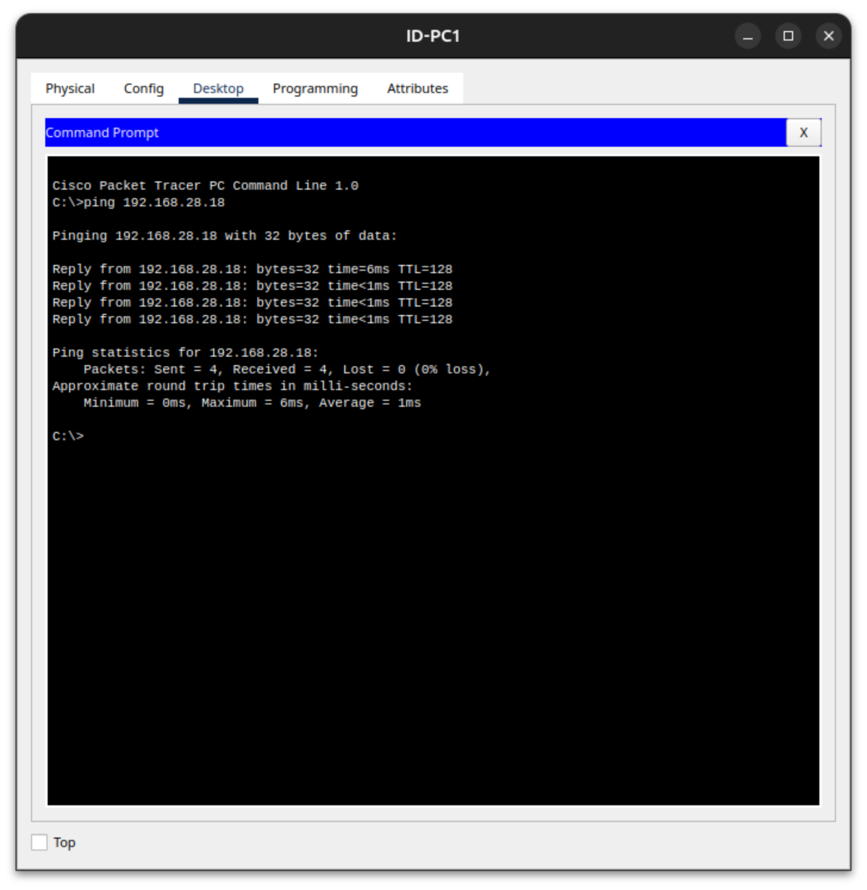

---

# Verificación de PVST

Antes de provocar una falla se ejecutó:

```cisco
show spanning-tree vlan 28
```

En `ID-SW3` se obtuvo:

```text
Interface   Role   Sts
Fa3/1       Root   FWD
Fa4/1       Altn   BLK
```

Esto indica que:

- `Fa3/1` funciona como camino principal hacia el Root Bridge.
- `Fa4/1` permanece bloqueado como camino alternativo.
- La existencia de un puerto bloqueado evita un bucle de Capa 2.

El Root Bridge detectado fue:

```text
Priority: 4124
Address: 0030.A36E.B520
```

Esta dirección corresponde a `CORE-SW`.


---

# Prueba de redundancia y reconvergencia PVST

Para comprobar la redundancia se ejecutó un ping continuo desde `ID-PC1` hacia `ID-PC8`:

```cmd
ping -t 192.168.28.18
```

Posteriormente se desconectó el enlace:

```text
ID-SW1 Fa3/1 <------> ID-SW3 Fa3/1
```

Durante la convergencia se observaron pérdidas temporales:

```text
Reply from 192.168.28.18
Reply from 192.168.28.18

Request timed out.
Request timed out.
Request timed out.
Request timed out.
Request timed out.

Reply from 192.168.28.18
Reply from 192.168.28.18
Reply from 192.168.28.18
```

La comunicación se recuperó automáticamente sin realizar cambios manuales en la configuración.

Esto demuestra que PVST detectó la falla y utilizó el enlace redundante disponible.

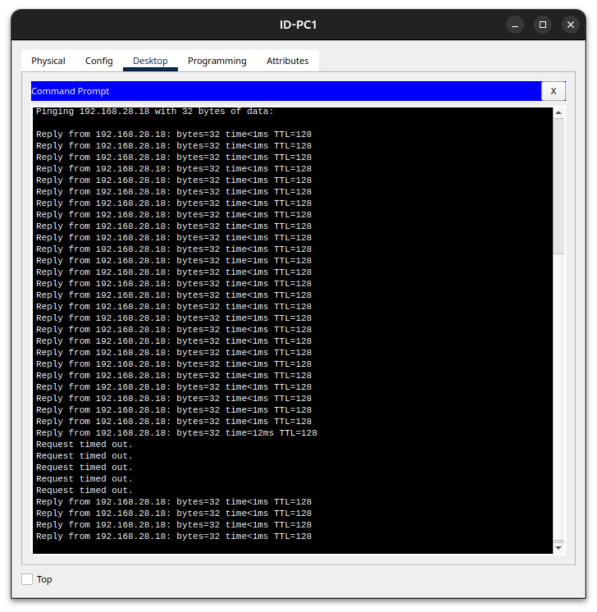

---

# Cambio del Root Port después de la falla

Después de desconectar `Fa3/1`, se ejecutó:

```cisco
show spanning-tree vlan 28
```

La nueva salida mostró:

```text
Root ID
 Priority    4124
 Address     0030.A36E.B520
 Cost        50
 Port        5(FastEthernet4/1)
```

Y:

```text
Fa4/1   Root FWD
```

Antes de la falla:

```text
Fa3/1   Root FWD
Fa4/1   Altn BLK
```

Después de la falla:

```text
Fa4/1   Root FWD
```

Por lo tanto, el enlace que anteriormente estaba bloqueado asumió automáticamente el tráfico.

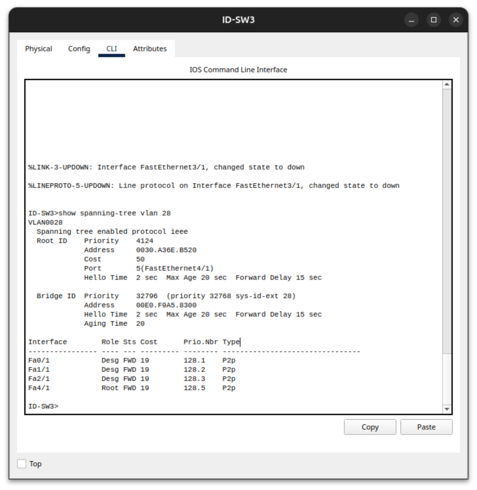

---

# Restauración del enlace

Finalmente se volvió a conectar:

```text
ID-SW1 Fa3/1 <------> ID-SW3 Fa3/1
```

Después de permitir la reconvergencia de PVST se verificó nuevamente:

```cisco
show spanning-tree vlan 28
```

La topología regresó a su estado original:

```text
Fa3/1   Root FWD
Fa4/1   Altn BLK
```

El costo hacia el Root Bridge regresó de:

```text
50
```

a:

```text
31
```

Esto confirma que PVST volvió a seleccionar el camino principal de menor costo.

---

# Estado final del Centro de I+D

| Elemento | Estado |
|---|---|
| 3 switches instalados | ✅ |
| 8 estaciones de trabajo | ✅ |
| VLAN 28 INVESTIGACION | ✅ |
| VTP Client en los switches | ✅ |
| Dominio VTP `Smart_1` | ✅ |
| VTP versión 2 | ✅ |
| PVST | ✅ |
| CORE-SW como Root Bridge | ✅ |
| Trunks 802.1Q | ✅ |
| VLAN nativa 98 | ✅ |
| Topología redundante | ✅ |
| EtherChannel LACP hacia CORE-SW | ✅ |
| Dos enlaces de fibra hacia CORE-SW | ✅ |
| Conectividad intra-VLAN | ✅ |
| Prueba de reconvergencia | ✅ |
| Failover automático mediante STP | ✅ |

---

## Conclusión del Centro de I+D

La implementación del Centro de Investigación y Desarrollo cumple con los requisitos de conectividad, segmentación y redundancia.

Las ocho estaciones se encuentran dentro de la VLAN 28 `INVESTIGACION`, mientras que los tres switches están interconectados mediante enlaces troncales redundantes.

El enlace principal hacia el Centro de Datos utiliza un EtherChannel LACP formado por dos enlaces de fibra, proporcionando mayor capacidad que un enlace troncal individual.

PVST evita los bucles generados por la topología redundante y permite que, ante la pérdida del enlace principal, un puerto previamente bloqueado pase automáticamente a estado `Forwarding`, recuperando la conectividad.

---
## 6. Edificio Corporativo

El Edificio Corporativo fue diseñado con dos alas de trabajo conectadas mediante una topología redundante. Se utilizaron los switches `CORP-DIST`, `CORP-A` y `CORP-B`, además de un switch independiente para la red inalámbrica de visitantes denominado `VISIT-SW`.

La finalidad de esta sección es proporcionar conectividad a los dispositivos administrativos de la VLAN de Gerencia y, al mismo tiempo, mantener aislada la red inalámbrica de Visitantes.

### 6.1 Topología implementada

La estructura lógica implementada es la siguiente:

```text
                         CORE-SW
                            |
                          Fibra
                            |
                        CORP-DIST
                       /         \
                      /           \
                 CORP-A -------- CORP-B
                    |                |
                 GER-PC1          GER-PC2
                                     |
                                  VISIT-SW
                                     |
                               AP-VISITANTES
                                )))       )))
                           VIS-LAP1     VIS-LAP2
```

Se creó un enlace redundante entre `CORP-A` y `CORP-B`. Debido a que esta conexión forma un ciclo físico, PVST se encarga de bloquear uno de los caminos para evitar loops de Capa 2.

---

### 6.2 Distribución de puertos

#### CORP-DIST

| Puerto | Dispositivo conectado | Función |
|---|---|---|
| Fa0/1 | CORP-A Fa0/1 | Trunk |
| Fa1/1 | CORP-B Fa0/1 | Trunk |
| Fa3/1 | CORE-SW | Trunk de fibra hacia Core |

#### CORP-A

| Puerto | Dispositivo conectado | Función |
|---|---|---|
| Fa0/1 | CORP-DIST Fa0/1 | Trunk |
| Fa1/1 | CORP-B Fa1/1 | Trunk redundante |
| Fa2/1 | GER-PC1 | Access VLAN 18 |

#### CORP-B

| Puerto | Dispositivo conectado | Función |
|---|---|---|
| Fa0/1 | CORP-DIST Fa1/1 | Trunk |
| Fa1/1 | CORP-A Fa1/1 | Trunk redundante |
| Fa2/1 | GER-PC2 | Access VLAN 18 |
| Fa3/1 | VISIT-SW Fa0/1 | Trunk de visitantes |

#### VISIT-SW

| Puerto | Dispositivo conectado | Función |
|---|---|---|
| Fa0/1 | CORP-B Fa3/1 | Trunk VLAN 58 y 98 |
| Fa1/1 | AP-VISITANTES | Access VLAN 58 |

---

### 6.3 Configuración VTP

Los switches principales del Edificio Corporativo fueron configurados como clientes VTP:

- `CORP-DIST`
- `CORP-A`
- `CORP-B`

Parámetros utilizados:

```text
Dominio VTP: Smart_1
Contraseña: proyecto12S2026
Versión: 2
Modo: Client
```

Configuración utilizada:

```cisco
vtp domain Smart_1
vtp password proyecto12S2026
vtp version 2
vtp mode client
```

Gracias a VTP, estos switches recibieron desde `CORE-SW` las VLAN configuradas para el proyecto:

| VLAN | Nombre |
|---:|---|
| 18 | GERENCIA |
| 28 | INVESTIGACION |
| 38 | PRODUCCION |
| 48 | SERVIDORES |
| 58 | VISITANTES |
| 98 | NATIVA |

---

### 6.4 Configuración de enlaces Trunk

Todos los enlaces principales entre los switches corporativos utilizan IEEE 802.1Q.

La VLAN 98 fue definida como VLAN nativa:

```cisco
switchport mode trunk
switchport trunk native vlan 98
switchport trunk allowed vlan 18,28,38,48,58,98
```

Los enlaces troncales principales transportan:

```text
18,28,38,48,58,98
```

En el enlace hacia la red de visitantes se restringieron las VLAN permitidas a:

```text
58,98
```

Configuración aplicada entre `CORP-B` y `VISIT-SW`:

```cisco
interface fastEthernet 3/1
 switchport mode trunk
 switchport trunk native vlan 98
 switchport trunk allowed vlan 58,98
```

Esto permite limitar el segmento de visitantes únicamente a las VLAN necesarias.

---

### 6.5 Redundancia mediante PVST

Por requerimiento del proyecto se utilizó PVST.

```cisco
spanning-tree mode pvst
```

`CORE-SW` se mantiene como Root Bridge de las VLAN del proyecto.

Para la VLAN 18 se obtuvo:

```text
Root ID Priority: 4114
Root Bridge MAC: 0030.A36E.B520
```

El valor de prioridad corresponde a:

```text
4096 + VLAN 18 = 4114
```

En `CORP-A` se observó el siguiente comportamiento:

```text
Fa0/1   Root FWD
Fa1/1   Altn BLK
```

El puerto `Fa0/1` es el camino principal hacia el Root Bridge, mientras que `Fa1/1` permanece como camino alternativo bloqueado.

De esta manera, la topología mantiene un enlace redundante sin generar loops de Capa 2.

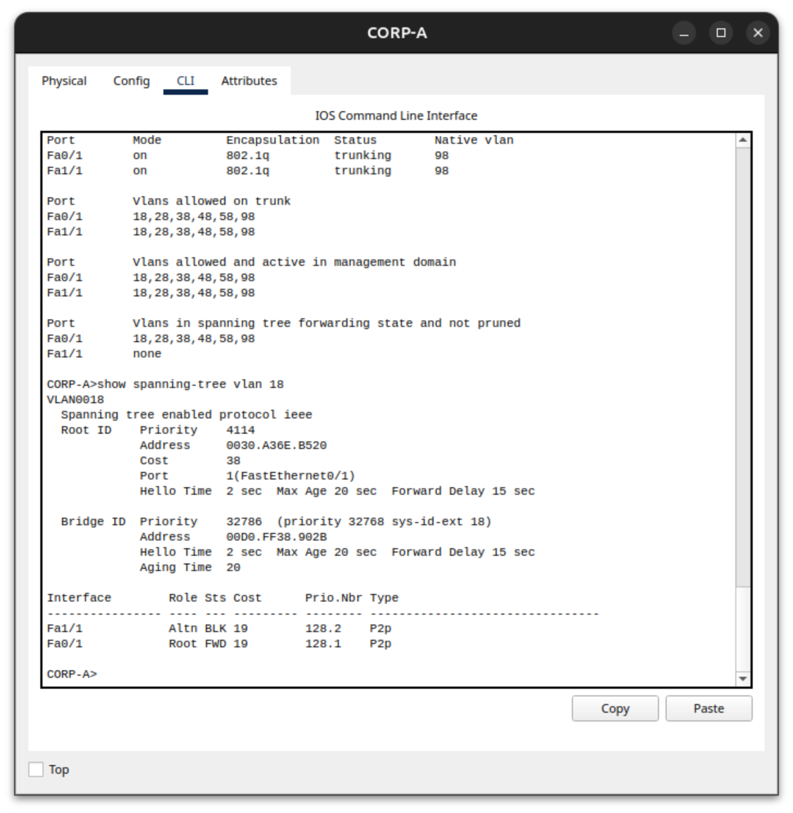

---

### 6.6 VLAN 18 - Gerencia

Los equipos administrativos fueron colocados en la VLAN 18.

#### Puertos

```text
CORP-A Fa2/1 → GER-PC1
CORP-B Fa2/1 → GER-PC2
```

Configuración utilizada:

```cisco
interface fastEthernet 2/1
 switchport mode access
 switchport access vlan 18
```

#### Direccionamiento

| Dispositivo | VLAN | Dirección IP | Máscara |
|---|---:|---|---|
| GER-PC1 | 18 | 192.168.18.11 | 255.255.255.0 |
| GER-PC2 | 18 | 192.168.18.12 | 255.255.255.0 |

No se configuró Default Gateway debido a que el proyecto trabaja únicamente a nivel de Capa 2 y no se implementó routing inter-VLAN.

---

### 6.7 Prueba de conectividad de Gerencia

Desde `GER-PC1` se realizó:

```text
ping 192.168.18.12
```

Resultado:

```text
Packets: Sent = 4, Received = 4, Lost = 0
```

La pérdida fue:

```text
0%
```

Esto demuestra que dos dispositivos ubicados en diferentes alas del Edificio Corporativo pueden comunicarse correctamente al pertenecer a la misma VLAN.


---

### 6.8 Red de Visitantes

Para la red de visitantes se utilizó un switch independiente denominado `VISIT-SW`.

A diferencia de los demás switches corporativos, este dispositivo fue configurado en modo VTP Transparent.

```cisco
vtp domain Smart_1
vtp password proyecto12S2026
vtp version 2
vtp mode transparent
spanning-tree mode pvst
```

Las VLAN necesarias fueron definidas localmente:

```cisco
vlan 58
 name VISITANTES
exit

vlan 98
 name NATIVA
exit
```

El enlace hacia `CORP-B` utiliza:

```text
VLAN permitidas: 58,98
VLAN nativa: 98
```

El puerto conectado al Access Point pertenece a VLAN 58:

```cisco
interface fastEthernet 1/1
 switchport mode access
 switchport access vlan 58
```

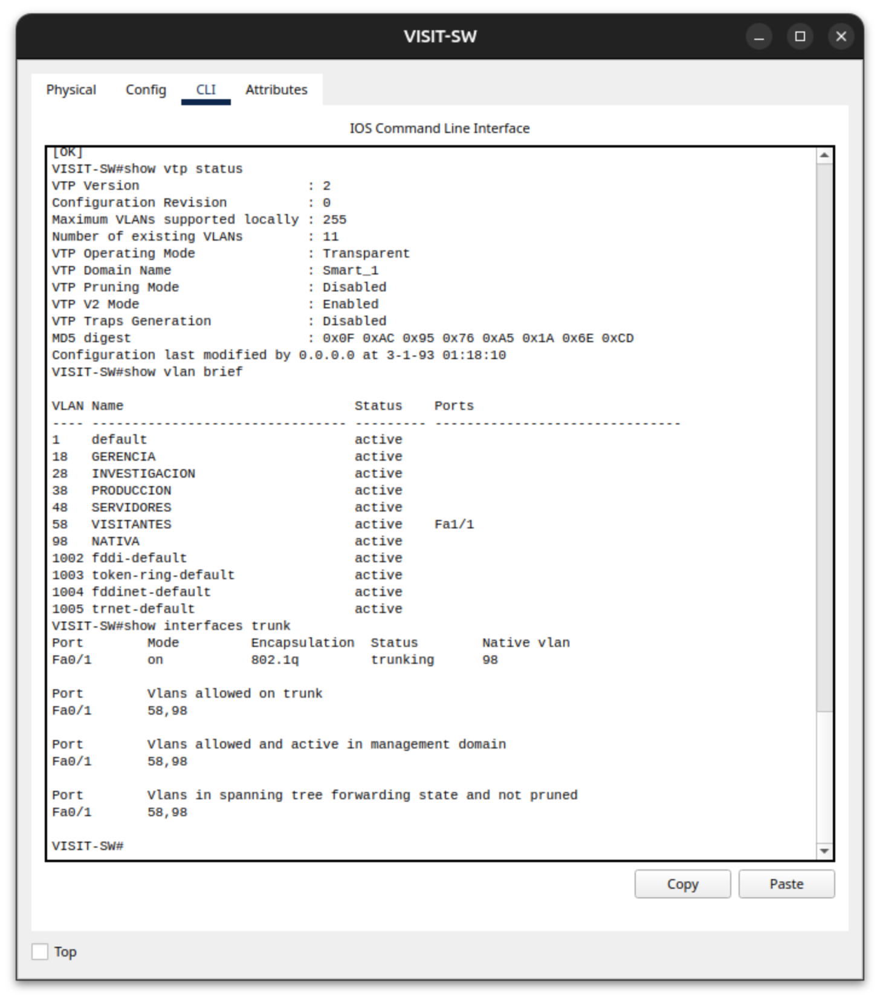

---

### 6.9 Configuración inalámbrica

Se instaló un Access Point denominado:

```text
AP-VISITANTES
```

La red inalámbrica fue configurada con los siguientes parámetros:

| Parámetro | Valor |
|---|---|
| SSID | VISITANTES_202113318 |
| Banda | 2.4 GHz |
| Canal | 6 |
| Seguridad | WPA2-PSK |
| Cifrado | AES |
| PSK | TechPark58 |

La implementación de WPA2-PSK permite restringir el acceso inalámbrico a los dispositivos que poseen la contraseña configurada.

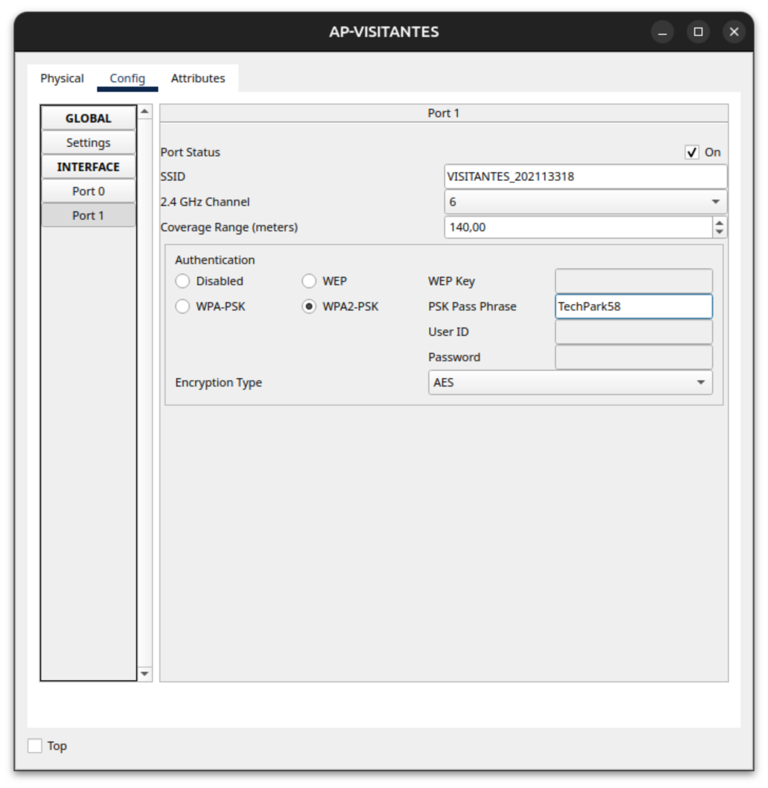

---

### 6.10 Equipos inalámbricos

Las laptops `VIS-LAP1` y `VIS-LAP2` fueron equipadas con módulos inalámbricos `WPC300N`.

Ambas se conectaron al SSID:

```text
VISITANTES_202113318
```

utilizando WPA2-PSK.

El direccionamiento utilizado fue:

| Dispositivo | VLAN | Dirección IP | Máscara |
|---|---:|---|---|
| VIS-LAP1 | 58 | 192.168.58.11 | 255.255.255.0 |
| VIS-LAP2 | 58 | 192.168.58.12 | 255.255.255.0 |

No se configuró Default Gateway debido a que no existe routing inter-VLAN.

---

### 6.11 Prueba de conectividad inalámbrica

Desde `VIS-LAP1` se ejecutó:

```text
ping 192.168.58.12
```

Resultado:

```text
Packets: Sent = 4, Received = 4, Lost = 0
```

Porcentaje de pérdida:

```text
0%
```

La prueba demuestra que los dos dispositivos conectados de forma inalámbrica pueden comunicarse dentro de la VLAN 58.

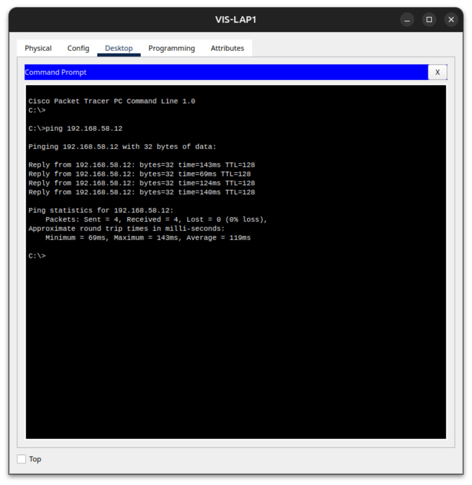

---

### 6.12 Aislamiento entre Gerencia y Visitantes

También se verificó que dispositivos pertenecientes a VLAN diferentes no pudieran comunicarse.

Desde:

```text
GER-PC1
IP: 192.168.18.11
VLAN: 18
```

se realizó:

```text
ping 192.168.58.11
```

hacia:

```text
VIS-LAP1
IP: 192.168.58.11
VLAN: 58
```

Resultado:

```text
Request timed out.

Packets: Sent = 4, Received = 0, Lost = 4
```

Porcentaje de pérdida:

```text
100%
```

Este comportamiento es correcto, debido a que las VLAN 18 y 58 representan dominios de broadcast diferentes y el proyecto no implementa routing inter-VLAN.

De esta manera, la red administrativa de Gerencia permanece aislada de la red inalámbrica utilizada por los visitantes.

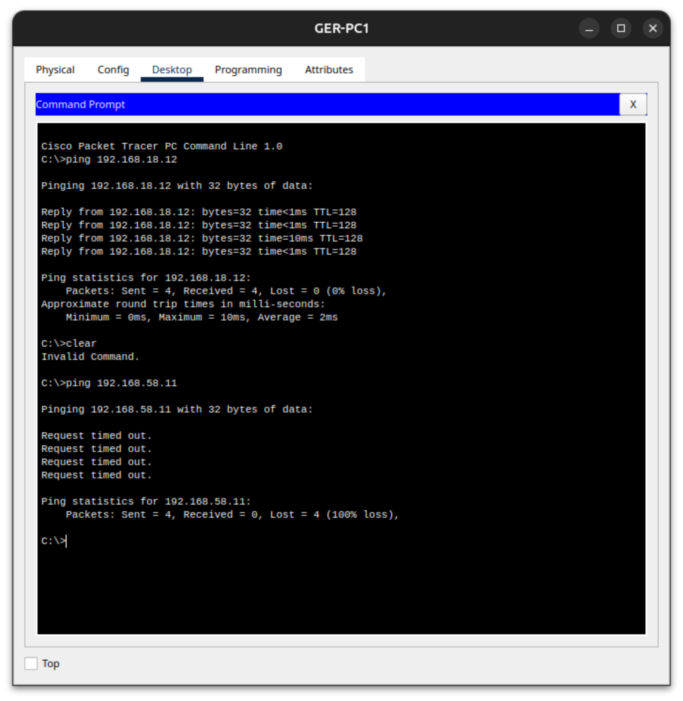

---

### 6.13 Resumen del Edificio Corporativo

La implementación del Edificio Corporativo permite demostrar los siguientes conceptos:

- Segmentación mediante VLAN.
- Uso de VLAN nativa 98.
- Enlaces Trunk IEEE 802.1Q.
- VTP versión 2.
- Switches en modo VTP Client.
- Switch de visitantes en modo VTP Transparent.
- Redundancia física entre switches.
- Prevención de loops mediante PVST.
- Uso de un puerto Alternate/Blocking.
- Comunicación entre dispositivos de la misma VLAN.
- Implementación de una WLAN.
- Seguridad WPA2-PSK con AES.
- Aislamiento entre VLAN 18 y VLAN 58.
- Funcionamiento completamente en Capa 2, sin routing inter-VLAN.

---

## 7. Área de Producción

El Área de Producción fue diseñada para representar un segmento de red industrial donde existen dispositivos Legacy conectados mediante un Hub.

Esta sección permite demostrar el funcionamiento de la VLAN 38 `PRODUCCION`, la conexión mediante Trunk hacia el switch central, la operación de VTP y, principalmente, la diferencia entre el comportamiento de un Hub y un Switch respecto a los dominios de colisión.

La red de Producción funciona únicamente en Capa 2 y no posee routing inter-VLAN.

---

### 7.1 Topología implementada

La estructura implementada es la siguiente:

```text
                         CORE-SW
                            |
                          Fibra
                            |
                         PROD-SW
                            |
                         Fa0/1
                            |
                       HUB-LEGACY
                     /    /   \    \
                    /    /     \    \
               MAQ-01 MAQ-02 MAQ-03 MAQ-04
```

El switch `PROD-SW` proporciona la conexión entre el segmento Legacy y el backbone principal de la red.

Los cuatro equipos de Producción están conectados a un Hub para representar un entorno donde todos los dispositivos comparten el mismo medio físico.

---

### 7.2 Dispositivos utilizados

Para esta sección se utilizaron los siguientes dispositivos:

| Dispositivo | Tipo | Función |
|---|---|---|
| PROD-SW | Switch-PT | Switch de acceso del área de Producción |
| HUB-LEGACY | Hub-PT | Segmento Legacy compartido |
| MAQ-01 | PC-PT | Máquina de Producción |
| MAQ-02 | PC-PT | Máquina de Producción |
| MAQ-03 | PC-PT | Máquina de Producción |
| MAQ-04 | PC-PT | Máquina de Producción |

---

### 7.3 Módulos instalados en PROD-SW

En `PROD-SW` se instalaron dos módulos:

```text
1 × PT-SWITCH-NM-1FFE
1 × PT-SWITCH-NM-1CFE
```

Su utilización fue:

| Puerto | Tipo | Dispositivo conectado |
|---|---|---|
| Fa0/1 | Cobre FastEthernet | HUB-LEGACY |
| Fa1/1 | Fibra FastEthernet | CORE-SW Fa9/1 |

El enlace de fibra proporciona la conexión entre Producción y el switch central de la infraestructura.

---

### 7.4 Enlace entre CORE-SW y PROD-SW

El enlace principal quedó establecido de la siguiente manera:

```text
CORE-SW Fa9/1  <------ Fibra ------>  PROD-SW Fa1/1
```

Este enlace fue configurado como Trunk IEEE 802.1Q.

Configuración utilizada en `CORE-SW`:

```cisco
interface fastEthernet 9/1
 switchport mode trunk
 switchport trunk native vlan 98
 switchport trunk allowed vlan 18,28,38,48,58,98
exit
```

Configuración utilizada en `PROD-SW`:

```cisco
interface fastEthernet 1/1
 switchport mode trunk
 switchport trunk native vlan 98
 switchport trunk allowed vlan 18,28,38,48,58,98
exit
```

La VLAN nativa utilizada es:

```text
VLAN 98 - NATIVA
```

Las VLAN permitidas sobre el enlace son:

```text
18,28,38,48,58,98
```

---

### 7.5 Configuración VTP

`PROD-SW` fue configurado como cliente VTP.

Los parámetros utilizados fueron:

```text
Dominio VTP: Smart_1
Contraseña: proyecto12S2026
Versión: 2
Modo: Client
```

Configuración aplicada:

```cisco
vtp domain Smart_1
vtp password proyecto12S2026
vtp version 2
vtp mode client
```

La verificación mediante:

```cisco
show vtp status
```

mostró:

```text
VTP Version: 2
VTP Operating Mode: Client
VTP Domain Name: Smart_1
VTP V2 Mode: Enabled
```

Esto confirma que `PROD-SW` forma parte correctamente del dominio VTP del proyecto.

---

### 7.6 Configuración PVST

El switch de Producción utiliza PVST:

```cisco
spanning-tree mode pvst
```

Esto mantiene consistencia con la configuración utilizada en el resto de la infraestructura.

El `CORE-SW` continúa funcionando como Root Bridge para las VLAN definidas en la topología.

---

### 7.7 VLAN 38 - PRODUCCION

El puerto de `PROD-SW` conectado al Hub fue configurado como puerto Access perteneciente a VLAN 38.

Configuración:

```cisco
interface fastEthernet 0/1
 switchport mode access
 switchport access vlan 38
exit
```

La verificación mediante:

```cisco
show vlan brief
```

mostró:

```text
38   PRODUCCION   active   Fa0/1
```

Debido a que el Hub está conectado al puerto `Fa0/1`, todos los dispositivos conectados al `HUB-LEGACY` pertenecen a la VLAN 38.

---

### 7.8 Verificación de Trunk, VLAN y VTP

Se utilizaron los comandos:

```cisco
show vlan brief
show interfaces trunk
show vtp status
```

Los resultados confirmaron:

```text
Fa0/1 → VLAN 38 PRODUCCION
Fa1/1 → Trunk IEEE 802.1Q
Native VLAN → 98
VTP Mode → Client
VTP Domain → Smart_1
```

El enlace `Fa1/1` transporta correctamente las VLAN:

```text
18,28,38,48,58,98
```

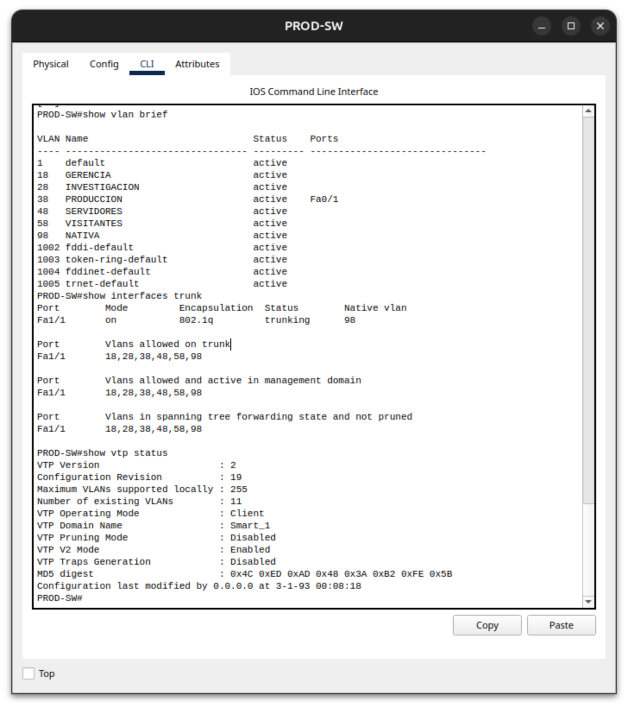

---

### 7.9 Direccionamiento de las máquinas

Las cuatro máquinas fueron configuradas dentro de la red:

```text
192.168.38.0/24
```

El direccionamiento utilizado fue:

| Dispositivo | VLAN | Dirección IP | Máscara |
|---|---:|---|---|
| MAQ-01 | 38 | 192.168.38.11 | 255.255.255.0 |
| MAQ-02 | 38 | 192.168.38.12 | 255.255.255.0 |
| MAQ-03 | 38 | 192.168.38.13 | 255.255.255.0 |
| MAQ-04 | 38 | 192.168.38.14 | 255.255.255.0 |

No se configuró Default Gateway debido a que el proyecto trabaja únicamente a nivel de Capa 2 y no se implementó routing inter-VLAN.

---

### 7.10 Prueba de conectividad dentro de Producción

Para comprobar la comunicación dentro de VLAN 38 se realizó una prueba desde:

```text
MAQ-01
192.168.38.11
```

hacia:

```text
MAQ-04
192.168.38.14
```

Comando utilizado:

```text
ping 192.168.38.14
```

La prueba fue exitosa, obteniendo comunicación entre ambas máquinas.

Esto demuestra que los dispositivos conectados al `HUB-LEGACY` pueden comunicarse correctamente dentro de la VLAN 38.

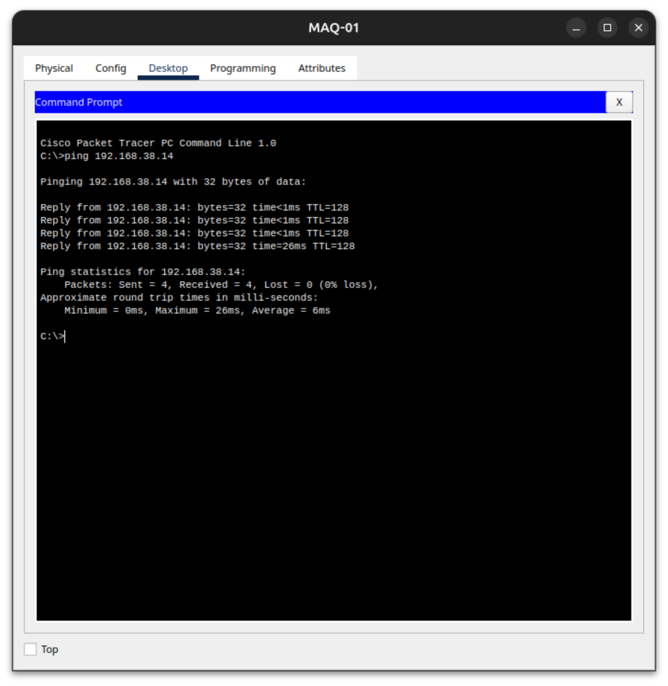

---

### 7.11 Segmento Legacy y dominio de colisión

El dispositivo `HUB-LEGACY` fue utilizado específicamente para representar un entorno Legacy.

Un Hub funciona en la Capa 1 del modelo OSI y no posee una tabla de direcciones MAC.

Cuando recibe una señal por uno de sus puertos, la replica hacia los demás puertos.

Por esta razón, los siguientes elementos comparten un único dominio de colisión:

```text
MAQ-01
MAQ-02
MAQ-03
MAQ-04
HUB-LEGACY
Enlace hacia PROD-SW Fa0/1
```

A diferencia de un switch, el Hub no crea un dominio de colisión independiente por cada puerto.

---

### 7.12 Simulación del funcionamiento del Hub

Para observar el comportamiento del segmento Legacy se utilizó el modo:

```text
Simulation
```

de Cisco Packet Tracer.

Se dejaron visibles principalmente los protocolos:

```text
ARP
ICMP
```

Se generó tráfico entre diferentes máquinas de Producción.

En el Event List se pudo observar que `HUB-LEGACY` participa repetidamente en el envío de las tramas debido a que replica la señal recibida hacia sus demás puertos.

Esta simulación permite observar el comportamiento característico de un Hub como repetidor de Capa 1.

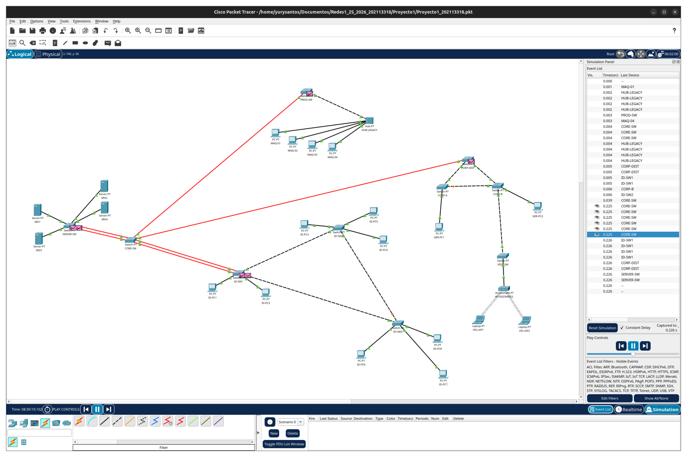

---

### 7.13 Dominios de colisión

La implementación permite diferenciar el comportamiento de un Hub y un Switch.

| Segmento | Dominios de colisión |
|---|---:|
| HUB-LEGACY + MAQ-01 + MAQ-02 + MAQ-03 + MAQ-04 + enlace PROD-SW Fa0/1 | 1 |
| Enlace PROD-SW Fa1/1 ↔ CORE-SW Fa9/1 | 1 enlace independiente |

Todos los dispositivos conectados al Hub comparten el mismo dominio de colisión.

El enlace entre switches constituye un segmento independiente.

---

### 7.14 Dominio de broadcast

Los dispositivos de Producción pertenecen a:

```text
VLAN 38 PRODUCCION
```

Por lo tanto, forman parte de un mismo dominio de broadcast a nivel lógico.

```text
VLAN 38 = 1 dominio de broadcast
```

Las otras VLAN de la infraestructura representan dominios de broadcast separados.

---

### 7.15 Aislamiento entre VLAN 38 y VLAN 18

Finalmente, se comprobó el aislamiento entre Producción y Gerencia.

Desde:

```text
MAQ-01
IP: 192.168.38.11
VLAN: 38 PRODUCCION
```

se ejecutó:

```text
ping 192.168.18.11
```

hacia:

```text
GER-PC1
IP: 192.168.18.11
VLAN: 18 GERENCIA
```

El resultado fue:

```text
Request timed out.
```

La prueba final obtuvo pérdida total de los paquetes enviados.

Este comportamiento es correcto debido a que las VLAN 38 y 18 pertenecen a diferentes dominios de broadcast y no existe routing inter-VLAN en la infraestructura.

Esto demuestra que el Área de Producción permanece aislada de la red administrativa de Gerencia.

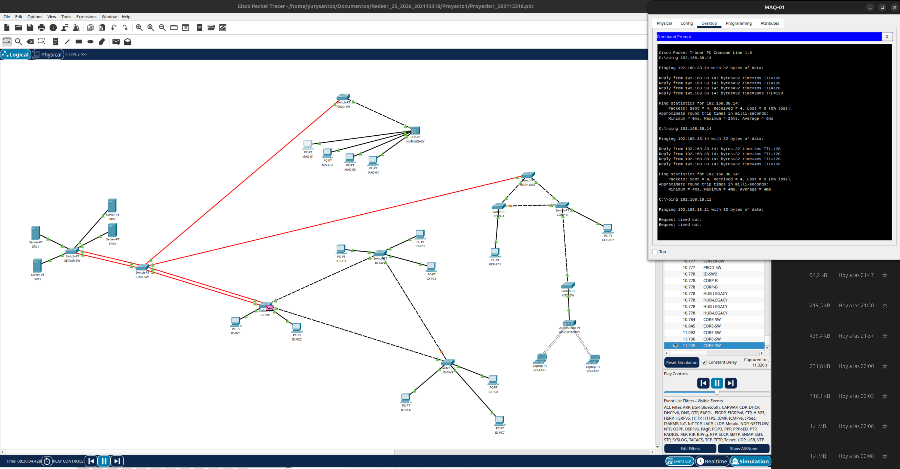

---

### 7.16 Resumen del Área de Producción

La implementación del Área de Producción permite demostrar los siguientes conceptos:

- VLAN 38 `PRODUCCION`.
- Enlaces Trunk IEEE 802.1Q.
- VLAN nativa 98.
- VTP versión 2.
- Switch en modo VTP Client.
- PVST.
- Conexión de fibra hacia el Core.
- Funcionamiento de un Hub de Capa 1.
- Segmento Legacy.
- Dominio de colisión compartido.
- Comunicación entre dispositivos de la misma VLAN.
- Dominio de broadcast de VLAN 38.
- Aislamiento entre VLAN 38 y VLAN 18.
- Operación de la infraestructura sin routing inter-VLAN.

Con estas pruebas se verificó que el Área de Producción funciona correctamente y cumple con el objetivo de representar tanto una red Ethernet conmutada como un segmento Legacy basado en un medio compartido.