# Manual Técnico — Tarea 3: VLANs y VTP en Cisco Packet Tracer

**Universidad de San Carlos de Guatemala**  
Facultad de Ingeniería  
Escuela de Ingeniería en Ciencias y Sistemas  
Laboratorio — Redes de Computadoras 1 - A  
Segundo Semestre 2026

**Tema:** Configuración, verificación y pruebas de conectividad con VLANs y VTP.

---

## Índice

1. [Introducción](#1-introducción)
2. [Objetivos](#2-objetivos)
3. [Diseño de la red](#3-diseño-de-la-red)
4. [Scripts de configuración](#4-scripts-de-configuración)
5. [Evidencias y verificación](#5-evidencias-y-verificación)
6. [Resumen de resultados](#6-resumen-de-resultados)
7. [Conclusiones](#7-conclusiones)
8. [Archivos de entrega](#8-archivos-de-entrega)

---

# 1. Introducción

En esta práctica se implementó una red segmentada mediante VLANs en Cisco Packet Tracer, utilizando cuatro switches Cisco 2960 y seis computadoras. La solución emplea el protocolo VTP para administrar y propagar la información de VLAN entre los switches, enlaces **trunk** para transportar tráfico de múltiples VLAN y puertos **access** para conectar los dispositivos finales.

La topología se organizó con **Switch0** como servidor VTP; los switches **ADMIN** y **MERCA** como clientes VTP; y el switch **VENTAS** en modo transparente. Se configuraron las VLAN 10 (ADMIN), 20 (MERCA) y 30 (VENTAS), y se realizaron pruebas de conectividad para comprobar la comunicación dentro de una misma VLAN y el aislamiento entre VLANs diferentes.

# 2. Objetivos

## 2.1 Objetivo general

Configurar y verificar una red segmentada mediante VLANs y VTP en Cisco Packet Tracer, comprobando la propagación de VLAN, la operación de enlaces trunk, la asignación de puertos de acceso y la conectividad entre equipos finales.

## 2.2 Objetivos específicos

- Configurar **Switch0** como servidor VTP, **ADMIN** y **MERCA** como clientes VTP, y **VENTAS** en modo VTP Transparent.
- Crear y verificar las VLAN **10 ADMIN**, **20 MERCA** y **30 VENTAS**.
- Configurar enlaces trunk entre el switch central y los switches de acceso.
- Asignar los puertos de las PCs a su VLAN correspondiente mediante modo access.
- Asignar direccionamiento IPv4 estático y comprobar conectividad dentro de cada VLAN.
- Comprobar el aislamiento entre VLANs distintas en ausencia de enrutamiento inter-VLAN.

# 3. Diseño de la red

## 3.1 Topología implementada

La red está formada por un switch central y tres switches de acceso. Cada switch de acceso conecta dos computadoras y mantiene un enlace trunk con Switch0.

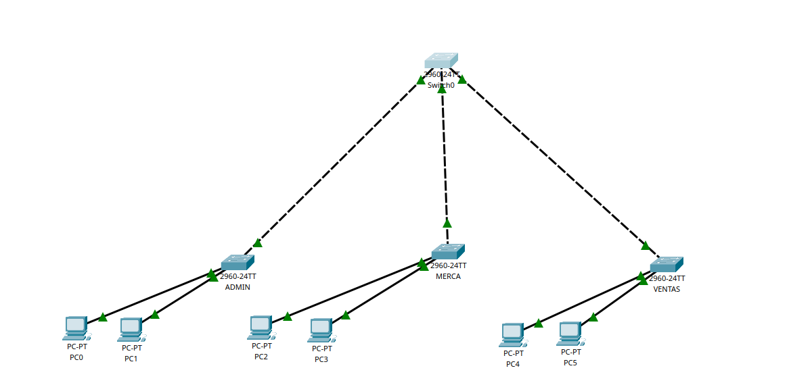

*Figura 1. Topología final implementada en Cisco Packet Tracer.*

## 3.2 Roles VTP

| Dispositivo | Rol VTP | Función principal |
|---|---|---|
| Switch0 | Server | Administra la base de datos de VLAN y propaga los cambios. |
| ADMIN | Client | Recibe la información de VLAN desde el servidor VTP. |
| MERCA | Client | Recibe la información de VLAN desde el servidor VTP. |
| VENTAS | Transparent | Mantiene su base de datos local; la VLAN 30 se creó manualmente. |

## 3.3 Plan de VLAN y direccionamiento

| VLAN | Nombre | Subred | Equipos |
|---:|---|---|---|
| 10 | ADMIN | `192.168.10.0/24` | PC0: `192.168.10.1` / PC1: `192.168.10.2` |
| 20 | MERCA | `192.168.20.0/24` | PC2: `192.168.20.1` / PC3: `192.168.20.2` |
| 30 | VENTAS | `192.168.30.0/24` | PC4: `192.168.30.1` / PC5: `192.168.30.2` |

Todas las computadoras utilizan la máscara `255.255.255.0`. No se configuró puerta de enlace predeterminada porque la práctica no incluye enrutamiento inter-VLAN.

## 3.4 Mapa de interfaces

| Origen | Interfaz | Destino | Interfaz | Tipo |
|---|---|---|---|---|
| Switch0 | Fa0/1 | ADMIN | Fa0/1 | Trunk |
| Switch0 | Fa0/2 | MERCA | Fa0/1 | Trunk |
| Switch0 | Fa0/3 | VENTAS | Fa0/1 | Trunk |
| ADMIN | Fa0/2-3 | PC0-PC1 | Fa0 | Access VLAN 10 |
| MERCA | Fa0/2-3 | PC2-PC3 | Fa0 | Access VLAN 20 |
| VENTAS | Fa0/2-3 | PC4-PC5 | Fa0 | Access VLAN 30 |

# 4. Scripts de configuración

A continuación se presentan los scripts consolidados utilizados en cada switch. Estos bloques permiten reproducir la configuración realizada en Packet Tracer.

## 4.1 Switch0 — VTP Server

```cisco
enable
configure terminal
vtp version 2
vtp domain TAREA3
vtp password 123
vtp mode server

vlan 10
 name ADMIN
exit
vlan 20
 name MERCA
exit
vlan 30
 name VENTAS
exit

interface range fa0/1-3
 switchport mode trunk
 switchport trunk allowed vlan 10,20,30
exit

end
copy running-config startup-config
```

## 4.2 Switch ADMIN — VTP Client

```cisco
enable
configure terminal
vtp version 2
vtp domain TAREA3
vtp password 123
vtp mode client

interface fa0/1
 switchport mode trunk
 switchport trunk allowed vlan 10,20,30
exit

interface range fa0/2-3
 switchport mode access
 switchport access vlan 10
exit

end
copy running-config startup-config
```

## 4.3 Switch MERCA — VTP Client

```cisco
enable
configure terminal
vtp version 2
vtp domain TAREA3
vtp password 123
vtp mode client

interface fa0/1
 switchport mode trunk
 switchport trunk allowed vlan 10,20,30
exit

interface range fa0/2-3
 switchport mode access
 switchport access vlan 20
exit

end
copy running-config startup-config
```

## 4.4 Switch VENTAS — VTP Transparent

```cisco
enable
configure terminal
vtp version 2
vtp domain TAREA3
vtp password 123
vtp mode transparent

vlan 30
 name VENTAS
exit

interface fa0/1
 switchport mode trunk
 switchport trunk allowed vlan 10,20,30
exit

interface range fa0/2-3
 switchport mode access
 switchport access vlan 30
exit

end
copy running-config startup-config
```

## 4.5 Comandos de verificación

```cisco
show vtp status
show vlan brief
show interfaces trunk
show cdp neighbors
show ip interface brief
```

> **Nota:** En los switches VTP Client no se crearon manualmente las VLAN 10, 20 y 30; estas fueron recibidas desde Switch0 mediante VTP. En VENTAS, al operar en modo Transparent, la VLAN 30 se creó localmente.

# 5. Evidencias y verificación

Las siguientes capturas documentan la configuración y las verificaciones realizadas en Cisco Packet Tracer. Las figuras se presentan siguiendo el flujo lógico de la práctica.

## 5.1 Configuración del servidor VTP

Se configuró Switch0 con VTP versión 2, dominio `TAREA3`, contraseña `123` y modo Server.

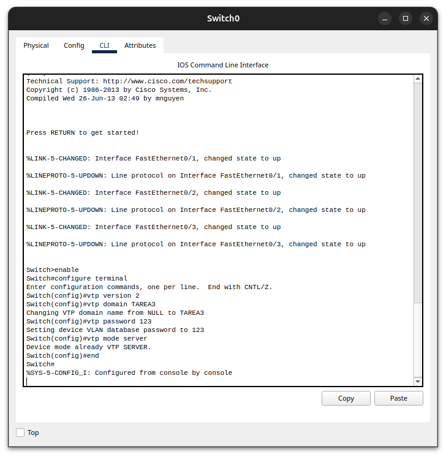

*Figura 2. Configuración inicial de Switch0 como servidor VTP.*

## 5.2 Verificación del servidor VTP

Mediante `show vtp status` se verificó que Switch0 pertenece al dominio `TAREA3` y opera en modo Server. La revisión de configuración se encontraba inicialmente en 0 antes de crear las VLAN.

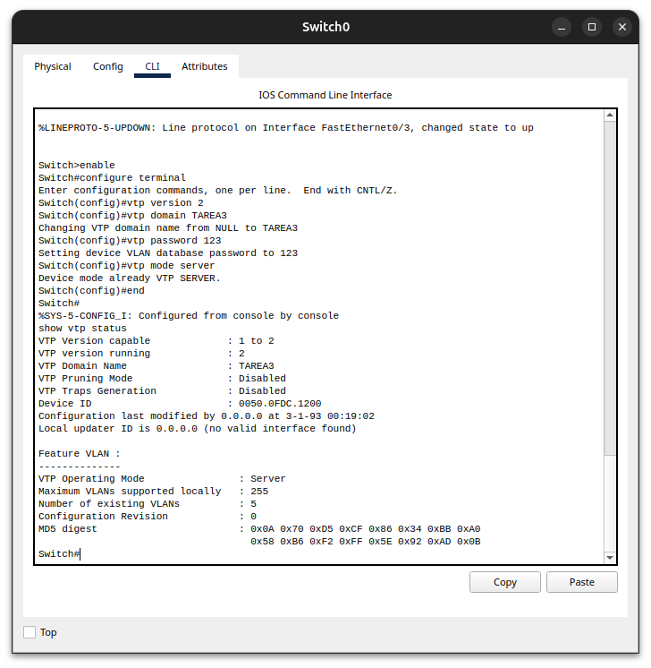

*Figura 3. Verificación de la configuración VTP en Switch0 mediante `show vtp status`.*

## 5.3 Creación de VLANs en Switch0

Se crearon las VLAN 10 ADMIN, 20 MERCA y 30 VENTAS. Con `show vlan brief` se comprobó que las tres se encontraban activas.

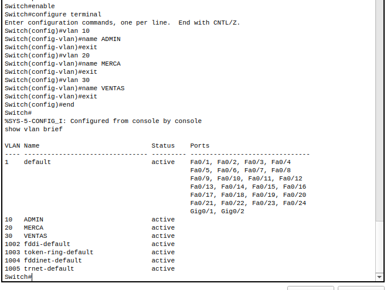

*Figura 4. Verificación de las VLAN creadas en Switch0 mediante `show vlan brief`.*

## 5.4 VTP Client en ADMIN

El switch ADMIN fue configurado con VTP versión 2, dominio `TAREA3` y modo Client. La salida de `show vtp status` confirma que pertenece al mismo dominio del servidor.


*Figura 5. Verificación de la configuración VTP en modo Client del switch ADMIN.*

## 5.5 VTP Client en MERCA

El switch MERCA fue configurado con VTP versión 2, dominio `TAREA3` y modo Client. La salida de `show vtp status` confirma su operación como cliente.

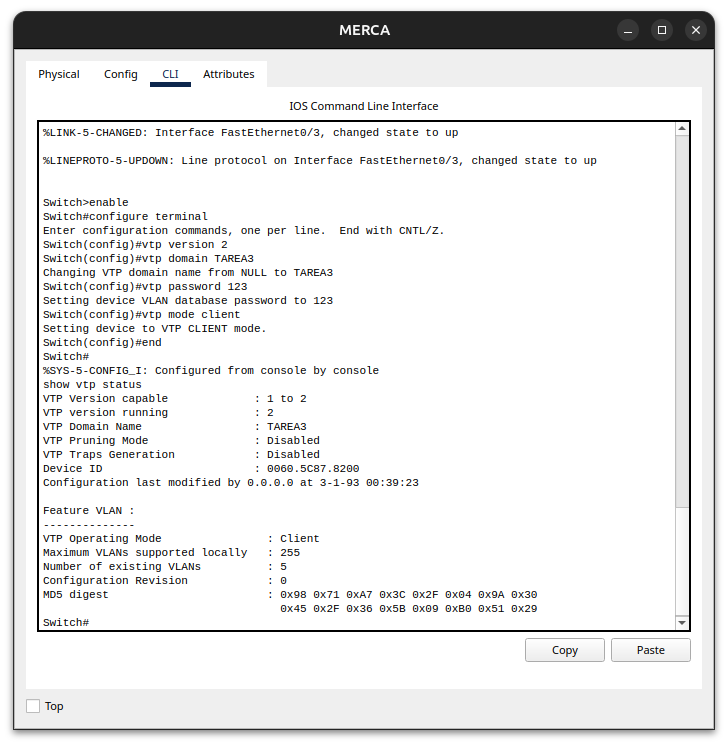

*Figura 6. Verificación de la configuración VTP en modo Client del switch MERCA.*

## 5.6 VTP Transparent en VENTAS

El switch VENTAS fue configurado con VTP versión 2, dominio `TAREA3` y modo Transparent.


*Figura 7. Verificación de la configuración VTP en modo Transparent del switch VENTAS.*

## 5.7 VLAN local en VENTAS

Debido a que VENTAS opera en modo VTP Transparent, se creó localmente la VLAN 30 VENTAS. La salida de `show vlan brief` confirma que se encuentra activa.

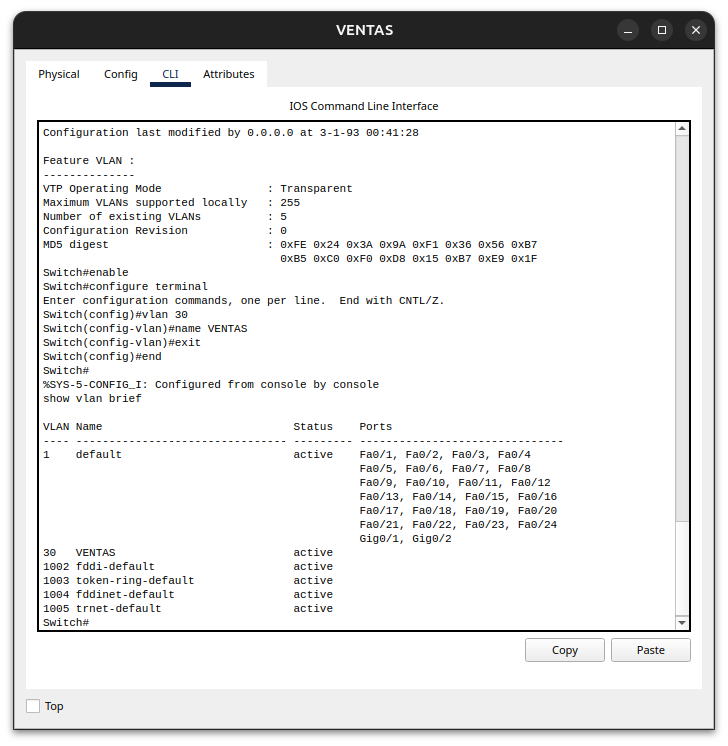

*Figura 8. Verificación de la VLAN 30 creada localmente en el switch VENTAS.*

## 5.8 Enlaces trunk en Switch0

Las interfaces Fa0/1, Fa0/2 y Fa0/3 del switch central se configuraron como trunk y permiten las VLAN 10, 20 y 30. `show interfaces trunk` confirma encapsulación 802.1Q y estado trunking.

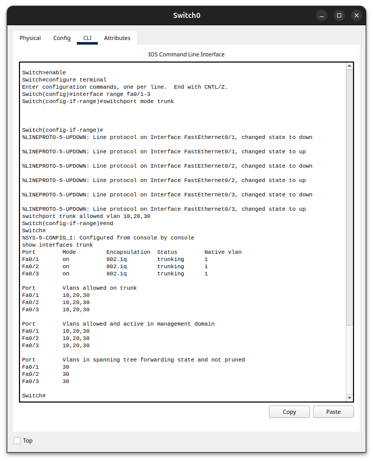

*Figura 9. Verificación de los enlaces trunk configurados en Switch0.*

## 5.9 Enlace trunk en ADMIN

La interfaz Fa0/1 de ADMIN se configuró como trunk hacia Switch0 y permite las VLAN 10, 20 y 30.

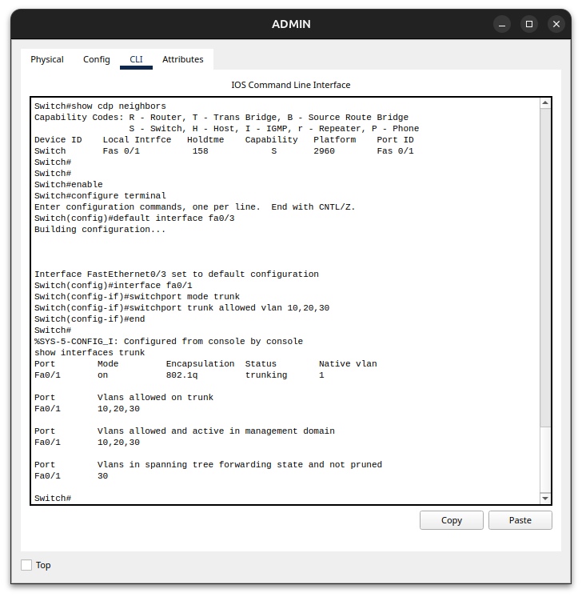

*Figura 10. Verificación del enlace trunk en el switch ADMIN.*

## 5.10 Enlace trunk en MERCA

La interfaz Fa0/1 de MERCA se configuró como trunk hacia Switch0 y permite las VLAN 10, 20 y 30.

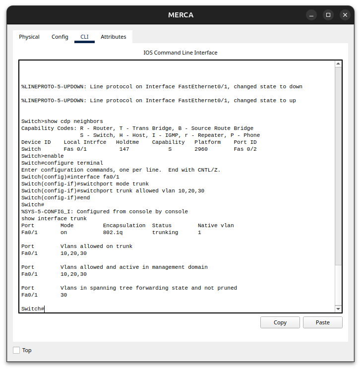

*Figura 11. Verificación del enlace trunk en el switch MERCA.*

## 5.11 Enlace trunk en VENTAS

La interfaz Fa0/1 de VENTAS se configuró como trunk. Debido al modo Transparent, la VLAN 30 es la VLAN local activa en este switch.

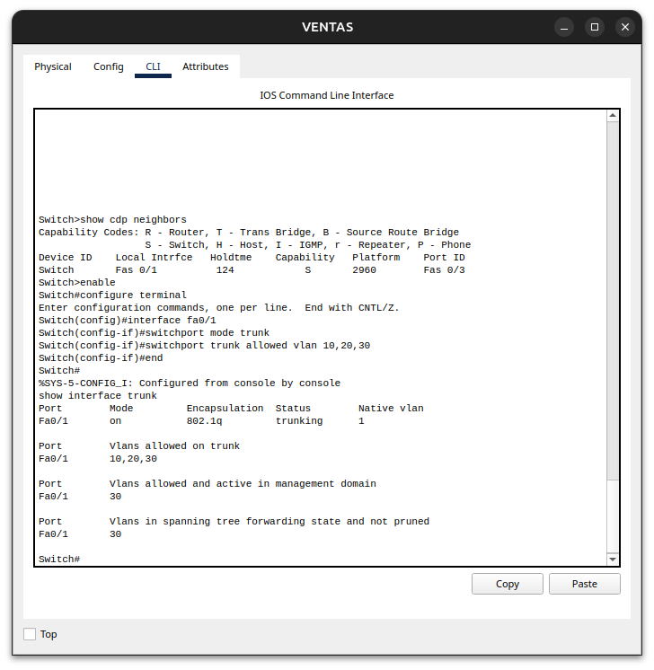

*Figura 12. Verificación del enlace trunk en el switch VENTAS.*

## 5.12 Propagación VTP hacia ADMIN

Con `show vlan brief` se comprobó que ADMIN recibió las VLAN 10, 20 y 30 desde Switch0, demostrando la propagación VTP a través del trunk.


*Figura 13. VLANs propagadas mediante VTP hacia el switch ADMIN.*

## 5.13 Propagación VTP hacia MERCA

Con `show vlan brief` se comprobó que MERCA recibió las VLAN 10, 20 y 30 desde Switch0.

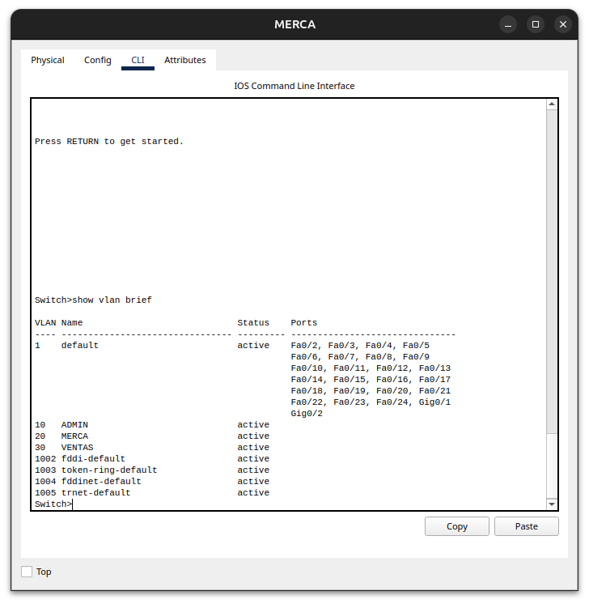

*Figura 14. VLANs propagadas mediante VTP hacia el switch MERCA.*

## 5.14 Puertos access en ADMIN

Las interfaces Fa0/2 y Fa0/3 se configuraron en modo access y se asignaron a la VLAN 10 ADMIN.

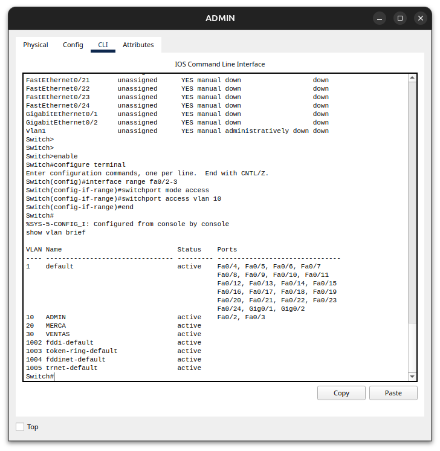

*Figura 15. Puertos Fa0/2 y Fa0/3 asignados a la VLAN 10 en ADMIN.*

## 5.15 Puertos access en MERCA

Las interfaces Fa0/2 y Fa0/3 se configuraron en modo access y se asignaron a la VLAN 20 MERCA. La salida final de `show vlan brief` confirma la asignación correcta.

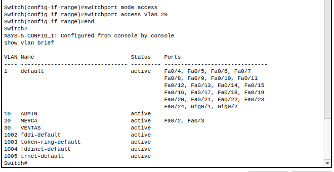

*Figura 16. Puertos Fa0/2 y Fa0/3 asignados a la VLAN 20 en MERCA.*

## 5.16 Puertos access en VENTAS

Las interfaces Fa0/2 y Fa0/3 se configuraron en modo access y se asignaron a la VLAN 30 VENTAS.

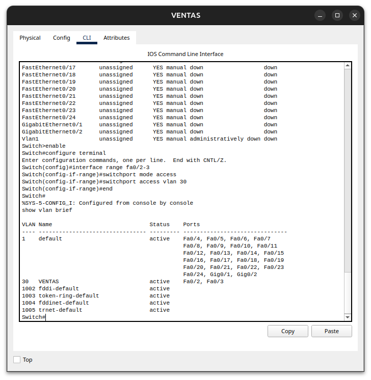

*Figura 17. Puertos Fa0/2 y Fa0/3 asignados a la VLAN 30 en VENTAS.*

## 5.17 Direccionamiento IPv4

Se asignaron direcciones IPv4 estáticas a las seis PCs según la VLAN correspondiente. La captura muestra PC0 con `192.168.10.1/24` como ejemplo.

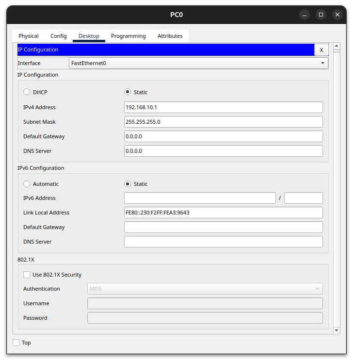

*Figura 18. Ejemplo de direccionamiento IPv4 estático en PC0, VLAN 10 ADMIN.*

## 5.18 Ping dentro de VLAN 10 ADMIN

Desde PC0 (`192.168.10.1`) se ejecutó ping hacia PC1 (`192.168.10.2`), obteniendo 4 respuestas y 0% de pérdida.


*Figura 19. Ping exitoso entre PC0 y PC1 dentro de la VLAN 10 ADMIN.*

## 5.19 Ping dentro de VLAN 20 MERCA

Desde PC2 (`192.168.20.1`) se ejecutó ping hacia PC3 (`192.168.20.2`), obteniendo 4 respuestas y 0% de pérdida.

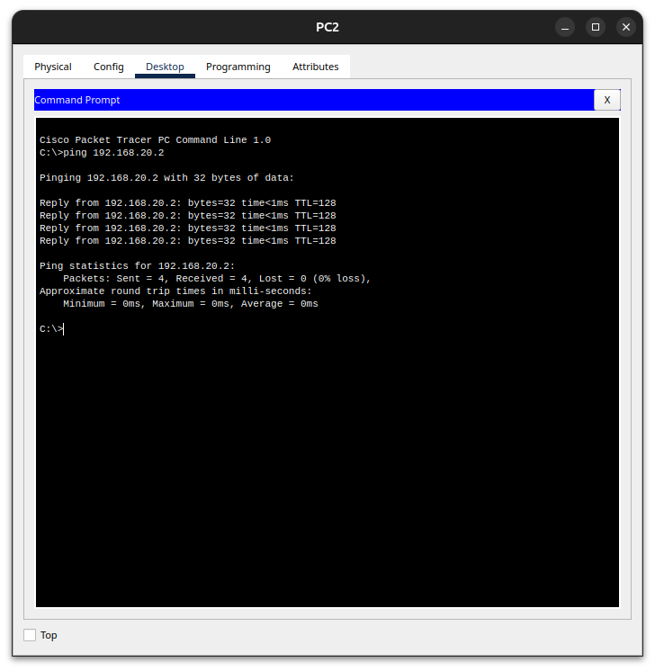

*Figura 20. Ping exitoso entre PC2 y PC3 dentro de la VLAN 20 MERCA.*

## 5.20 Ping dentro de VLAN 30 VENTAS

Desde PC4 (`192.168.30.1`) se ejecutó ping hacia PC5 (`192.168.30.2`), obteniendo 4 respuestas y 0% de pérdida.

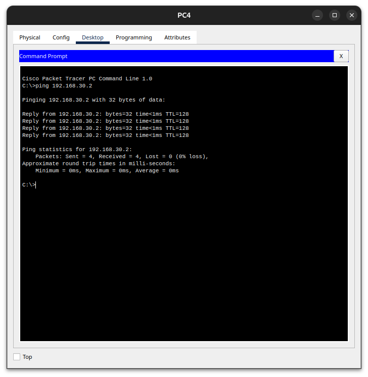

*Figura 21. Ping exitoso entre PC4 y PC5 dentro de la VLAN 30 VENTAS.*

## 5.21 Aislamiento entre VLANs

Se realizó un ping desde PC0 (VLAN 10) hacia PC2 (VLAN 20). La prueba presentó 100% de pérdida, demostrando que no existe comunicación entre VLANs distintas sin un mecanismo de enrutamiento inter-VLAN.


*Figura 22. Ping fallido entre VLAN 10 ADMIN y VLAN 20 MERCA, confirmando el aislamiento.*

# 6. Resumen de resultados

| Verificación | Resultado |
|---|---|
| Switch0 como VTP Server | Correcto |
| ADMIN y MERCA como VTP Client | Correcto |
| VENTAS como VTP Transparent | Correcto |
| VLAN 10, 20 y 30 creadas y activas | Correcto |
| Propagación VTP hacia ADMIN y MERCA | Correcto |
| Enlaces trunk 802.1Q | Correcto |
| Puertos access por VLAN | Correcto |
| Ping dentro de VLAN 10, 20 y 30 | Exitoso — 0% de pérdida |
| Ping VLAN 10 hacia VLAN 20 | Fallido — 100% de pérdida (comportamiento esperado) |

# 7. Conclusiones

- La configuración de VTP permitió centralizar la creación de VLAN en Switch0 y propagar correctamente la información hacia los switches ADMIN y MERCA configurados como clientes.
- Los enlaces trunk permitieron transportar las VLAN 10, 20 y 30 entre los switches, mientras que los puertos access garantizaron que cada computadora perteneciera únicamente a su VLAN asignada.
- Las pruebas de ping confirmaron conectividad entre equipos de la misma VLAN y aislamiento entre VLANs diferentes. El fallo de comunicación entre VLAN 10 y VLAN 20 es el resultado esperado al no existir enrutamiento inter-VLAN.
- El modo VTP Transparent aplicado en VENTAS permitió mantener la VLAN 30 de forma local, diferenciando su comportamiento respecto de los switches cliente.
